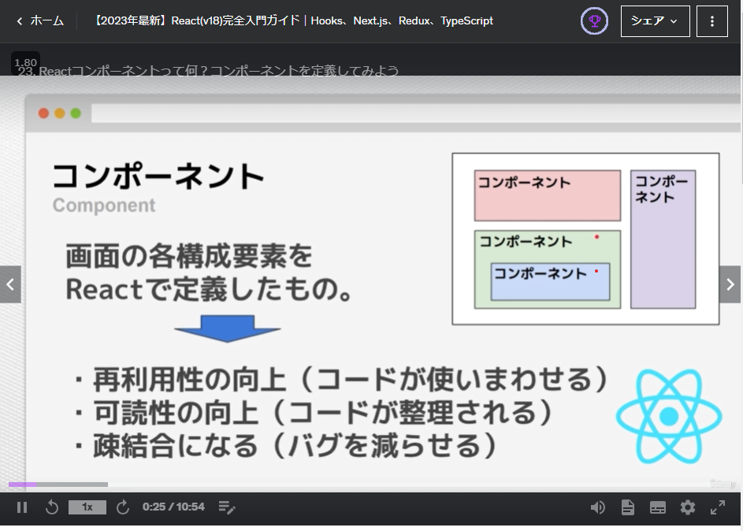
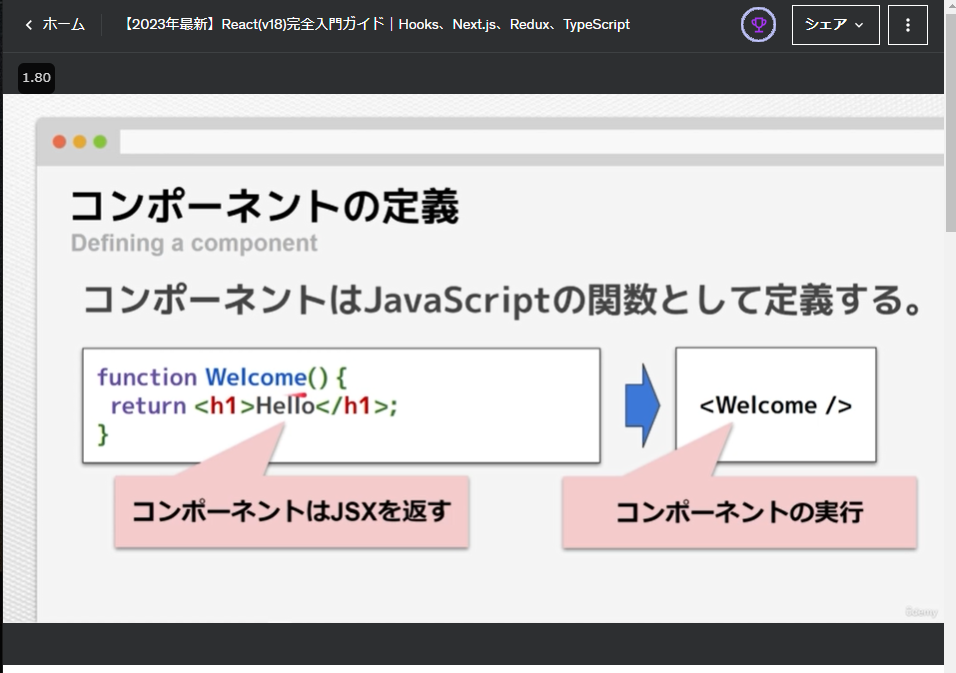

[to TopPage](../README.md)
# 04_まずはReactに触れてみよう

## 講座一覧
- [022_Reactを動かしてみよう](#022_reactを動かしてみよう)
- [023_Reactコンポーネントって何？コンポーネントを定義してみよう](#023_reactコンポーネントって何コンポーネントを定義してみよう)
- [024_Reactのプロジェクトの作成方法（create−react−appの使い方）](#024_reactのプロジェクトの作成方法create−react−appの使い方)
- [025_★重要★本コースで使用するプロジェクトの使い方](#025_★重要★本コースで使用するプロジェクトの使い方)
- [026_コンポーネントにスタイルを当ててみよう](#026_コンポーネントにスタイルを当ててみよう)
- [027_コンポーネントの分割方法](#027_コンポーネントの分割方法)
- [028_【練習】コンポーネントの分割方法](#028_【練習】コンポーネントの分割方法)
- [029_不要なタグを出力しないFragmentの使い方](#029_不要なタグを出力しないfragmentの使い方)
- [030_JSX内でJSコードを実行してみよう](#030_jsx内でjsコードを実行してみよう)
- [031_【TIPS】式と文の違い](#031_tips式と文の違い)
- [032_【練習】JSX内で式を使ってみよう](#032_練習jsx内で式を使ってみよう)
- [033_propsでコンポーネントに値を渡してみよう](#033_propsでコンポーネントに値を渡してみよう)
- [034_propsに色々な値を渡してみよう](#034_propsに色な値を渡してみよう)
- [035_【練習＆解答】propsで値を渡してみよう](#035_練習＆解答propsで値を渡してみよう)
- [036_特別なプロパティ：props．children](#036_特別なプロパティpropschildren)
- [037_propsの重要なルール](#037_propsの重要なルール)
- [038_JSXの正体](#038_jsxの正体)
- [039_React要素ツリーとコンポーネントツリー](#039_react要素ツリーとコンポーネントツリー)
- [040_セクションまとめ](#040_セクションまとめ)


## 022_Reactを動かしてみよう
[toTop](#)
- HTML内でReactを使う方法を紹介
  - libraryの`react.development.js`・`react-dom.development.js`・`babel-standalone.js`を読み込む
  - VS Codeの`Live Server`で[サイトを開く](http://127.0.0.1:5500/04_react_basic/extra_src/01_run_react/end/)

### ソース
- [end source](./extra_src/01_run_react/end//index.html)
```html
<!DOCTYPE html>
<html>
<head>
   <script src="/.libs/react.development.js"></script>
   <script src="/.libs/react-dom.development.js"></script>
   <script src="/.libs/babel-standalone.js"></script>
</head>
<body>
    <div id="app"></div>
    <script type="text/babel">
        // POINT ReactをHTMLにマウントする書き方
        const appEl = document.querySelector('#app');
        const root = ReactDOM.createRoot(appEl);
        root.render(<h1>こんにちは</h1>); <!-- 引数はJSX記法で書かれてる -->

        // POINT React18以前の書き方
        // ReactDOM.render(<h1>こんにちは</h1>, appEl)
    </script>
</body>
</html>
```

## 023_Reactコンポーネントって何？コンポーネントを定義してみよう
[toTop](#)

### コンポーネント概念
- 画面の構成要素をReactで定義したもの
- メリット：
  - 再利用性の向上(コードを使いまわせる)
  - 可読性の向上(コードが整理される)
  - 疎結合になる(バグを減らせる)
#### コンポーネント定義方法
- JSX構文でHTML要素を定義して関数の返り値にする

 １．React Component | ２．Component定義方法
 --|--
  | 

### ソース
- [end source](./extra_src/02_component/end/index.html)
  * POINT コンポーネントの先頭は大文字とする
    * 理由：`babel`がコンポーネントを認識する方法は、『先頭が大文字』を条件としているため
    * 関数コンポーネントで定義する（`function`でもアロー関数どちらでもよい）
  * POINT JSXが複数行の時は()で括る
    * 理由：`return`文の特性で、`return`のみだと`return;`と判定するので、`return ()`とする
    * `()`は何かをグループ化する指示
  * [`Go Live`のパス](http://127.0.0.1:5500/04_react_basic/extra_src/02_component/end/index.html)
```html
<!DOCTYPE html>
<html>

<head>
    <script src="/.libs/react.development.js"></script>
    <script src="/.libs/react-dom.development.js"></script>
    <script src="/.libs/babel-standalone.js"></script>
</head>

<body>
    <div id="app"></div>
    <script type="text/babel">
        const appEl = document.querySelector('#app');
        const root = ReactDOM.createRoot(appEl);

        // function Example() {
        //     return <h1>Hello Components</h1>;
        // }

        // POINT コンポーネントの先頭は大文字とする
        // POINT JSXが複数行の時は()で括る
        const Example = () => (
            <div>
                <h1>Hello Components</h1>
            </div>
        );

        const a = () => {
            return
            "戻り値";
        }

        console.log(a());

        root.render(<Example />);
    </script>
</body>

</html>
```

## 024_Reactのプロジェクトの作成方法（create−react−appの使い方）
[toTop](#)

### 作成方法
- テンプレートを使うコマンドを使用する
  * `create-react-app`(CRA)の場合、`npx create-react-app <app名>`を実行する
  * `vite`の場合、`npm create vite@latest <app名> -- --template react`
    * `npm create vite@latest`を実行すると対話形式でプロジェクトを作成できる
### 実行方法
* `create-react-app`(CRA)の場合、`npm run start`
  * 止めるときは、`[Ctrl+C]`を２回実行
* `vite`の場合、`npm run dev`
  * 止めるときは、`q + [Enter]`
#### 実行例
```sh
$ npm create vite@latest vite-project -- --template react
$ cd vite-project
$ pnpm i && pnpm run dev
  VITE v5.0.7  ready in 5863 ms
  ➜  Local:   http://localhost:5173/
  ➜  Network: use --host to expose
  ➜  press h + enter to show help
...
q + [Enter]
```

### ソース
- [end README.md](./extra_src/03_create_react_app/readme.md)

## 025_★重要★本コースで使用するプロジェクトの使い方
[toTop](#)
### 各セクションの準備方法
- `vite`でプロジェクトを作るので、[トップREADME](../README.md#教材ファイルをjsxファイルへコンバート)の方法で提供コンテンツをコンバートする


### 提供コンテンツのサンプルコード
- `vite`でプロジェクトを作ったので、講義動画と異なる方法で起動する
```sh
cd ./04_react_basic
# pnpm i
pnpm run dev
...
  VITE v5.0.4  ready in 7883 ms
  ➜  Local:   http://localhost:5173/
  ➜  Network: use --host to expose
  ➜  press h + enter to show help
```
- 起動後、[http://localhost:5173/](http://localhost:5173/) にアクセスする
- [package.json](./package.json)
```json
{
  "name": "04_react_basic",
  "private": true,
  "version": "0.0.0",
  "type": "module",
  "scripts": {
    "dev": "vite",
    "build": "vite build",
    "lint": "eslint . --ext js,jsx --report-unused-disable-directives --max-warnings 0",
    "preview": "vite preview"
  },
  "dependencies": {
    "react": "^18.2.0",
    "react-dom": "^18.2.0"
  },
  "devDependencies": {
    "@types/react": "^18.2.37",
    "@types/react-dom": "^18.2.15",
    "@vitejs/plugin-react": "^4.2.0",
    "eslint": "^8.53.0",
    "eslint-plugin-react": "^7.33.2",
    "eslint-plugin-react-hooks": "^4.6.0",
    "eslint-plugin-react-refresh": "^0.4.4",
    "vite": "^5.0.0",
    "web-vitals": "^3.5.0"
  }
}
```
### ソース
- [end source](./src/050_project_sample/end/Example.jsx)
- エントリーコンポーネント：
```jsx
const Example = () => {
  return (
    <div>
      <h3>endフォルダのコード</h3>
    </div>
  );
};
export default Example;
```


## 026_コンポーネントにスタイルを当ててみよう
[toTop](#)
- 簡易的なスタイリングは、CSSファイルを読み込む
  * `import`する際は相対パス（`./xxxx`）で指定する
  * JSX内でHTML要素にクラス名を指定する場合は、`clasName="（クラス名）"`で指定する
### ソース
- [end source](./src/060_styling/end/Example.jsx)
- エントリーコンポーネント：
```jsx
/* POINT コンポーネントのスタイリング
  (詳細は 07_styling_component で紹介)
*/

//  POINT CSS ファイルを import する
import "./Example.css";

const Example = () => {
  return (
    /* POINT クラス名は class ではなく className で指定する
    HTML のように見えますが、これは JSX と呼ばれる構文です。class 属性は className を使用しましょう。
    */

    /* POINT class と className
    React 16 以降では custom DOM attributes をサポートしているため class も使用可能です。（ただ、ウォーニングも出るため、非推奨！！）
    */
    <div className="component">
      <h3>Hello Component</h3>
    </div>
  );
};

export default Example;
```

- スタイルファイル：
```css
.App-end .component {
    padding: 1rem;
    color: blue;
    border: 5px solid blue;
}
```

## 027_コンポーネントの分割方法
[toTop](#)
- 下のような階層のコンポーネントを定義したい。
```uml
+- Example
    +- Child
        +- List
            +- ul>li*5
```
- 呼び出されるコンポーネントは`export`を定義。呼び出し側は`import`でコンポネント名まで定義する
  - 参考：`import`と`export`は、JavaScriptの[メモ](../03_js_basic/README.md#012_esmoduleのexport／importについて学ぼう)を参考に

### ソース
- [end source](./src/070_component_nest/end/Example.jsx)
- エントリーコンポーネント：
```jsx
import Child from "./components/Child";

const Example = () => <Child />;

export default Example;
```

- 呼び出すコンポーネント：
```jsx
// POINT List コンポーネントを名前付き import
import { List } from "./List";
import "./Child.css";

const Child = () => {
  return (
    <div className="component">
      <h3>Hello Component</h3>
      <List />
    </div>
  );
};

// POINT コンポーネントを default export
export default Child;

/* POINT default export の別の記法

export default () => {
  return (
    <div className="component">
      <h3>Hello Component</h3>
      <List />
    </div>
  );
};

*/
```

- `List`コンポーネント：
```jsx
const List = () => {
  return (
    <ul>
      <li>item-1</li>
      <li>item-2</li>
      <li>item-3</li>
      <li>item-4</li>
      <li>item-5</li>
    </ul>
  );
};

// POINT List コンポーネントを 名前付き export
export { List };

/* POINT 名前付き export の別の記法

export const List = () => {
  return (
    <ul>
      <li>item-1</li>
      <li>item-2</li>
      <li>item-3</li>
      <li>item-4</li>
      <li>item-5</li>
    </ul>
  );
};

*/
```

## 028_【練習】コンポーネントの分割方法
[toTop](#)

### ソース
- [end source](./src/073_practice_component/end/Example.jsx)


## 029_不要なタグを出力しないFragmentの使い方
[toTop](#)

### 問題：練習問題（コード）
```jsx
const Example = () => {
  return (
    <div>
      <h3>練習問題</h3>
      <p>/componentsフォルダをstart内に作成して、Childにコンポーネントを分離して、Exampleコンポーネントで読み込んでください。</p>
      { /* ↓↓↓ Childコンポーネントに移動 */ }
      <div className="component">
        <h3>Child Component</h3>
      </div>
      { /* ↑↑↑ Childコンポーネントに移動 */ }
    </div>
  );
};
 
export default Example;
```

### ソース(回答)
- [end source](./src/075_fragment/end/Example.jsx)
- エントリーコンポーネント：
```jsx
import Child from "./components/Child";

const Example = () => <Child />;

export default Example;
```
- `Child`コンポーネント：
```jsx
import "./Child.css";
import { Fragment } from "react";

const Child = () => {
  /* POINT Fragmentがなぜ必要なのか？
  Reactのコンポーネントはルート要素が１つでなければならない（独立したツリー構造になっている）というルールがあります。そのため、Fragmentを使うことで、複数の要素を返すコンポーネントを余分なノードを追加することなくまとめることができます。
  */
  return (
    <Fragment key="1">
      {/* POINT keyはFragmentが受け取ることができる唯一の属性 */}
      <div className="component">
        <h3>Hello Component</h3>
      </div>
      <h3>Hello Fragment</h3>
      <p>
        Lorem ipsum dolor sit amet consectetur adipisicing elit. Obcaecati
        repellat dolor doloribus iure consequatur soluta? Optio corrupti ratione
        suscipit recusandae eius perspiciatis illo corporis? Aliquam nam
        repellendus quos expedita est?
      </p>
    </Fragment>
  );
};

export default Child;
```

## 030_JSX内でJSコードを実行してみよう
[toTop](#)

- JSX(HTML定義)内にJavaScriptコードを定義する方法を紹介
  * 波括弧内は実行時に評価されます
    * マスタッシュ記号で囲む(`{...}`)
    * 波カッコに定義できるのは**式のみ（文は定義できない）**
  * 配列を子要素に指定すると配列の要素が値の列として展開されます
    ```jsx
    <h3>{arry}</h3>
    ```
  * 関数を呼び出して return した値を埋め込むこともできる
  * 波括弧内に JSX を記述することもできる

### ソース
- [end source](./src/080_expr_in_jsx/end/Example.jsx)
- エントリーコンポーネント：
```jsx
import Child from "./components/Child";
import Expression from "./components/Expression";

const Example = () => {
  return (
    <div>
      <Child />
      <Expression />
    </div>
  );
};

export default Example;
```
- `Expression`コンポーネント：
```jsx
/* POINT JSX には JavaScript 式を記述できる
JSX 内の 波括弧 {...} で囲んだ部分は JavaScript 式として実行時に評価されます。
 */
import "./Expression.css";

const Expression = () => {
  const title = "Expression";
  const arry = ["item1", "item2", "item3"];
  const hello = (arg) => `${arg} Function`;
  const jsx = <h3>Hello JSX</h3>;
  console.log(jsx);

  return (
    // POINT {...} は属性値にも使用できます。
    <div className={title.toLowerCase()}>
      {/* POINT 波括弧内は実行時に評価されます。 */}
      <h3>{"Hello " + title}</h3>
      {/* POINT 配列を子要素に指定すると配列の要素が値の列として展開されます。 */}
      <h3>{arry}</h3>
      {/* POINT 関数を呼び出して return した値を埋め込むこともできます。 */}
      <h3>{hello("Hello")}</h3>
      {/* POINT 波括弧内に JSX を記述することもできます。*/}
      {<h3>Hello JSX</h3>}
      {/* POINT 変数に代入したJSXも埋め込めます。 */}
      {jsx}
    </div>
  );
};

export default Expression;
```

## 031_【TIPS】式と文の違い
[toTop](#)
- 式とは、『何らかの値を返す記述』
- 文は、実行するが値は返さない
* 「式は文になる」。しかし、「文は式にならない」
* 式文というものもある
  * 値`1`は式。値＋セミコロン`1;`は式文と呼ばれる

### ソース
- [end source](./src/085_expr_and_state/end/Example.jsx)
- エントリーコンポーネント：
```jsx
/* POINT 式と文
式：何らかの値を返すもの（変数に代入できるもの）
文：変数宣言、for文、if文、switch文やセミコロンで区切るもの。
*/

import Child from "./components/Child";

const Example = () => <Child />;

export default Example;
```
- `Child`コンポーネント：
```jsx
import "./Child.css";

const Child = () => {
  const a = 1 === 1;
  console.log(a);
  const hello = (a)  => {
    if (a)
      return 'hello'
    else
      return 'false'
  }
  return (
    <div className="component">
      <h3>式と文</h3>
      {1 === 1} {/* 左は式なので、波カッコ内に書ける*/}
      {/* if (a) { 'hello'} */}{/* 左の記述は文となるため、波カッコ内に書けない*/}
    </div>
  );
};

export default Child;
```

## 032_【練習】JSX内で式を使ってみよう
[toTop](#)

### ソース
- [end source](./src/087_practice_expr/end/Example.jsx)


## 033_propsでコンポーネントに値を渡してみよう
[toTop](#)

### ソース
- [end source](./src/090_props/end/Example.jsx)


## 034_propsに色々な値を渡してみよう
[toTop](#)


## 035_【練習＆解答】propsで値を渡してみよう
[toTop](#)

### ソース
- [end source](./src/100_practice_props/end/Example.jsx)


## 036_特別なプロパティ：props．children
[toTop](#)

### ソース
- [end source](./src/110_props_children/end/Example.jsx)


## 037_propsの重要なルール
[toTop](#)

### ソース
- [end source](./src/120_props_rules/end/Example.jsx)


## 038_JSXの正体
[toTop](#)

### ソース
- [end source](./src/130_whats_jsx/end/Example.jsx)


## 039_React要素ツリーとコンポーネントツリー
[toTop](#)

### ソース
- [end source](./src/140_react_element_component/end/Example.jsx)


## 040_セクションまとめ
[toTop](#)

