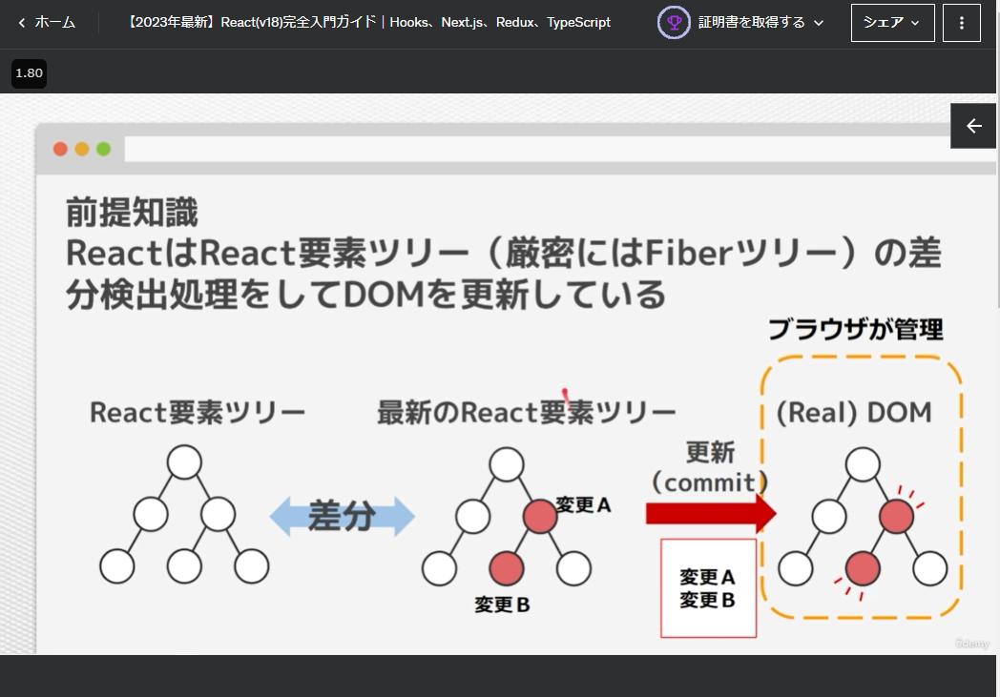
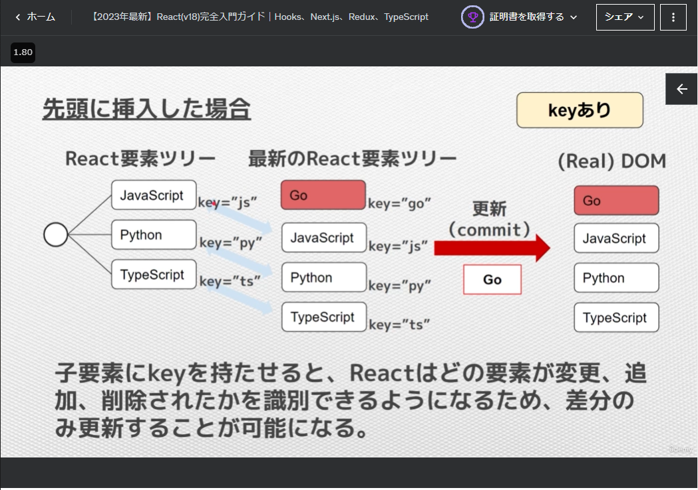

[to TopPage](../README.md)

# 06_制御構文とフォームの制御

## 講座一覧
- [058_セクション紹介](#058_セクション紹介)
- [059_配列をリスト表示](#059_配列をリスト表示)
- [060_【重要】リストには必ずキーを設定](#060_重要リストには必ずキーを設定)
- [061_【練習】リストにキーを設定してみよう](#061_練習リストにキーを設定してみよう)
- [062_配列のフィルターメソッドの使い方](#062_配列のフィルターメソッドの使い方)
- [063_【練習】フィルターメソッドの使い方を練習してみよう](#063_練習フィルターメソッドの使い方を練習してみよう)
- [064_条件分岐を設ける方法まとめ](#064_条件分岐を設ける方法まとめ)
- [065_コンポーネントのリファクタリング](#065_コンポーネントのリファクタリング)
- [066_【Form】inputとtextareaの作成方法](#066_forminputとtextareaの作成方法)
- [067_【Form】ラジオボタンの作成方法](#067_formラジオボタンの作成方法)
- [068_【Form】チェックボックスの作成方法](#068_formチェックボックスの作成方法)
- [069_【Form】複数選択チェックボックスの作成方法](#069_form複数選択チェックボックスの作成方法)
- [070_【Form】プルダウンの作成方法](#070_formプルダウンの作成方法)
- [071_Todoアプリを作ってみよう](#071_todoアプリを作ってみよう)


## 058_セクション紹介
[toTop](#)
- このセクションでは、制御構文とReactを組み合わせて使うときの注意点を紹介

## 059_配列をリスト表示
[toTop](#)
- リスト表示する元データ（配列）は、for文でJSXの配列を作成
```jsx
  const animalList = [];
  for (const animal of animals) {
    animalList.push(<li>{animal}</li>);
  }
```

### ソースコード
- [end source](./src/010_list_components/end/Example.jsx)
- エントリーコンポーネント：
```jsx

const animals = ["Dog", "Cat", "Rat"];

const Example = () => {
  // POINT for文でJSXの配列を作成
  const animalList = [];
  for (const animal of animals) {
    animalList.push(<li>{animal}</li>);
  }

  // POINT map関数でJSXの配列を作成
  const helloAnimals = animals.map((animal) => {
    return <li>Hello {animal}</li>;
  });

  return (
    <>
      <h3>配列の操作</h3>
      <ul>
        {/* <li>{animals[0]}</li>
        <li>{animals[1]}</li>
        <li>{animals[2]}</li> */}
        {/* {animalList}
        {helloAnimals} */}
        {/* POINT map関数はJSX内に記述可能 */}
        {animals.map((animal) => <li>Hello, {animal}</li>)}
      </ul>
    </>
  );
};

export default Example;
```

## 060_【重要】リストには必ずキーを設定
[toTop](#)

### なぜキーを付ける必要があるか？

- 前提知識：
  * React は React 要素ツリ ー (厳密には Fiber ツリ ー )の差分検出処理をして DOM を更新している
  * 差分を検出した要素配下を再レンダリングする
- キーなしの場合：
  * 全要素を再レンダリングする
- キーありの場合：
  * 更新したキーのある要素のみを再レンダリングする

 前提知識 | キーありの場合
 -- | --
 React は要素ツリーの差分検出してDOM更新 | キーのある要素が差分検出を助ける
  | 

### key を付ける際の注意点：
- キーには必ず一意の値を設定する。
- キーに設定した値は変更しない。
- 配列のインデックスはなるべく使わない。⇒画面で確認する

### コード
- [end source](./src/024_why_key_unique/end/Example.jsx)
- エントリーコンポーネント：
```jsx
import "./Example.css";
import { useState } from "react";

const Example = () => {
  const inputFact = () => ({
    key: Math.floor(Math.random() * 1e3),
    value: <input />,
  });

  const [inputs, setInputs] = useState([inputFact(), inputFact(), inputFact()]);

  const unshiftInput = () => {
    setInputs((prev) => [inputFact(), ...prev]);
  };
  return (
    <>
      <button onClick={unshiftInput}>先頭に追加</button>
      <div className="flex">
        <div>
          <strong>{`key={ユニークキー}`}</strong>
          <ul>
            {inputs.map((input) => (
              <li key={input.key}>
                {input.key}: {input.value}
              </li>
            ))}
          </ul>
        </div>
        <div>
          <strong>{`key={index}`}</strong>
          <ul>
            {inputs.map((input, index) => (
              <li key={index}>
                {input.key}: {input.value}
              </li>
            ))}
          </ul>
        </div>
      </div>
    </>
  );
};

export default Example;
```

## 061_【練習】リストにキーを設定してみよう
[toTop](#)

### 練習問題
- キーを設定したリスト表示を自分で書いて見てください。
```jsx
const Example = () => {
  return (
    <>
      <h3>練習問題</h3>
      <p>Profileコンポーネントを使用して、完成コードと同じ画面を作成してください。</p>
      <p>また、Profileコンポーネント内のリスト表示部分のkeyを設定して、ワーニング表示がされないようにしてください。</p>
      <ul>
        {/* ここに記述 */}
      </ul>
    </>
  );
};
 
export default Example; 
```

### 回答
- [end source](./src/030_practice_list/end/Example.jsx)
- エントリーコンポーネント：
```jsx
import Profile from "./components/Profile";

const persons = [
  {
    name: "Geo",
    age: 18,
    hobbies: ["sports", "music"],
  },
  {
    name: "Tom",
    age: 25,
    hobbies: ["movie", "music"],
  },
  {
    name: "Lisa",
    age: 21,
    hobbies: ["sports", "travel", "game"],
  },
];

const Example = () => {
  return (
    <>
      <ul>
        {/* mapで各要素に特定の処理を行ったものを新しい配列とする */}
        {persons.map((person) => (
            /* リストにはkeyを設定することを忘れないように！ */
            <li key={person.name}>
            <Profile {...person} />
          </li>
        ))}
      </ul>
    </>
  );
};

export default Example;
```

- `Profile`コンポーネント：
```jsx
const Profile = ({ name, age, hobbies }) => {
  return (
    <div>
      <hr />
      <div>Name: {name}</div>
      <div>Age: {age}</div>
      <div>
        <div>Hobby:</div>
        <ul>
          {hobbies.map((hobby) => (
            /* リストにはkeyを設定することを忘れないように！ */
            <li key={hobby}>{hobby}</li>
          ))}
        </ul>
      </div>
    </div>
  );
};

export default Profile;
```


## 062_配列のフィルターメソッドの使い方
[toTop](#)

- サンプルコード：[040_list_and_filter](./src/040_list_and_filter/end/)

## 063_【練習】フィルターメソッドの使い方を練習してみよう
[toTop](#)

- サンプルコード：[050_practice_filter/end](./src/050_practice_filter/end/)
- 練習コード：[050_practice_filter/start](./src/050_practice_filter/start/)

## 064_条件分岐を設ける方法まとめ
[toTop](#)

- サンプルコード：[060_conditional_render](./src/060_conditional_render/end/)
- if文、三項演算子、そのほか、(特定の条件の場合は)&&演算子やnull合体演算子 の実装方法がある
  * おすすめは三項演算子（コードの修正が発生した場合の変更量が減るため）
```jsx
import { useState } from "react";

/* POINT 条件分岐 if文、&&、??（Null合体演算子）、３項演算子
  A ?? B (Aがnull or undefinedの時、Bを使う)
*/
const Example = () => {
  const animals = ["Dog", "Cat", null, "Rat"];

  const [filterVal, setFilterVal] = useState("");

  return (
    <>
      <input
        type="text"
        value={filterVal}
        onChange={(e) => setFilterVal(e.target.value)}
      />
      <ul>
        {animals
          .filter((animal) => {
            const animalStr = animal ?? "";
            const isMatch = animalStr.indexOf(filterVal) !== -1;

            return isMatch;
          })
          .map((animal) => {
            return (
              <li key={animal}>
                {
                  // POINT if文のばあい
                  // if(animal === "Dog") {
                  //   return <li key={animal}>{animal}★</li>
                  // } else {
                  //   return <li key={animal}>{animal}</li>
                  // }

                  // POINT 3項演算子のばあい
                  animal + (animal === "Dog" ? "★" : "")

                  // POINT null合体演算子のばあい
                  // animal ?? "null,undefinedでした"

                }
                {/* POINT &&演算子 */}
                {
                    // animal === "Dog" && "★"
                }
              </li>
            );
          })}
      </ul>
    </>
  );
};

export default Example;
```
## 065_コンポーネントのリファクタリング
[toTop](#)

- サンプルコード：[070_refactor_components](./src/070_refactor_components/end/)
- コンポーネント毎にファイル分割する
- ルートコンポネントを下のようにしたい
```jsx
// POINT コンポーネントのリファクタリング

import { useState } from "react";

import AnimalList from "./components/AnimalList"
import AnimalFilter from "./components/AnimalFilter"

const Example = () => {
  const animals = ["Dog", "Cat", "Rat"];

  const [filterVal, setFilterVal] = useState("");

  const filterdAnimals = animals.filter((animal) => {
    const isMatch = animal.indexOf(filterVal) !== -1;
    return isMatch;
  });

  return (
    <>
      <AnimalFilter filterState={[filterVal, setFilterVal]}/>
      <AnimalList animals={filterdAnimals} />
    </>
  );
};

export default Example;
```

## 066_【Form】inputとtextareaの作成方法
[toTop](#)

- サンプルコード：[080_input_textarea](./src/080_input_textarea/end/)
```jsx
import { useState } from "react";

// POINT input要素、textarea要素の使い方
const Example = () => {

  const [val, setVal] = useState("");
  const clearVal = () => setVal("");

  return (
    <div>
      <label htmlFor="456">ラベル</label>
      <div>
        <input
          id="123"
          placeholder="こんにちは"
          value={val}
          onChange={(e) => setVal(e.target.value)}
        />
        <textarea
          id="456"
          placeholder="こんにちは"
          value={val}
          onChange={(e) => setVal(e.target.value)}
        />
      </div>
      <h3>{val}</h3>
      <button onClick={clearVal}>クリア</button>
    </div>
  );
};

export default Example;
```


## 067_【Form】ラジオボタンの作成方法
[toTop](#)


- サンプルコード：[090_radio](./src/090_radio/end/)
```jsx
import { useState } from "react";

// POINT ラジオボタンの実装
const Example = () => {
  const [fruit, setFruit] = useState("Apple");
  const onChange = (e) => setFruit(e.target.value);

  const RADIO_COLLECTION = ["Apple", "Banana", "Cherry"];

  return (
    <>
      {RADIO_COLLECTION.map((value) => {
        return (
          <label key={value}>
            <input
              type="radio"
              value={value}
              checked={fruit === value}
              onChange={onChange}
            />
            {value}
          </label>
        );
      })}
      <h3>私は{fruit}がたべたい</h3>
    </>
  );
};

export default Example;
```

## 068_【Form】チェックボックスの作成方法
[toTop](#)

- サンプルコード：[100_single_checkbox](./src/100_single_checkbox/end/)
```jsx
import { useState } from "react";

// POINT チェックボックスの実装
const Example = () => {
  const [isChecked, setIsChecked] = useState(true);

  // const toggleChecked = (e) => {
  //   setIsChecked(prevState => !prevState);
  // };

  return (
    <div>
      <label htmlFor="my-check">
        チェック：
      </label>
      <input
        type="checkbox"
        id="my-check"
        checked={isChecked}
        onChange={() => setIsChecked(prevState => !prevState)}
      />
      <div>{isChecked ? "ON!" : "OFF!"}</div>
    </div>
  );
};

export default Example;
```


## 069_【Form】複数選択チェックボックスの作成方法
[toTop](#)

- 複数のチェックボックスを評価したい場合、filter関数でチェックボックス全体を評価する
  * forEachバージョン
  * filter + forEachバージョン
  * filter + reduceバージョン
- サンプルコード：[110_multi_checkbox](./src/110_multi_checkbox/end/)
```jsx
import { useState } from "react";

// POINT 複数チェックボックスの実装
const Example = () => {
  const [fruits, setFruits] = useState([
    { label: "Apple", value: 100, checked: false },
    { label: "Banana", value: 200, checked: false },
    { label: "Cherry", value: 300, checked: false },
  ]);

  const [sum, setSum] = useState(0);

  const handleChange = (e) => {
    const newFruits = fruits.map((fruit) => {
      const newFruit = { ...fruit };
      if (newFruit.label === e.target.value) {
        newFruit.checked = !fruit.checked;
      }

      return newFruit;
    });

    setFruits(newFruits);

    // filter + reduceバージョン
    let sumVal = newFruits
      .filter((fruit) => fruit.checked)
      .reduce((sumVal, fruit) => sumVal + fruit.value, 0);
    setSum(sumVal);
  };
  return (
    <div>
      {fruits.map((fruit) => {
        return (
          <div key={fruit.label}>
            <input
              id={fruit.label}
              type="checkbox"
              value={fruit.label}
              checked={fruit.checked}
              onChange={handleChange}
            />
            <label htmlFor={fruit.label}>
              {fruit.label}:{fruit.value}
            </label>
          </div>
        );
      })}
      <div>合計：{sum}</div>
    </div>
  );
};

export default Example;
```

## 070_【Form】プルダウンの作成方法
[toTop](#)

- サンプルコード：[120_select](./src/120_select/end/)
```jsx
import { useState } from "react";

// POINT プルダウンの実装
const Example = () => {
  const [selected, setSelected] = useState("Banana");

  const OPTIONS = ["Apple", "Banana", "Cherry"];

  return (
    <>
      <select
        value={selected}
        onChange={(e) => setSelected(e.target.value)}
      >
        {OPTIONS.map(opt => <option key={opt} value={opt}>{opt}</option>)}
      </select>
      <div>選択された果物：{selected}</div>
    </>
  );
};

export default Example;
```

## 071_Todoアプリを作ってみよう
[toTop](#)

- サンプルコード：[130_reminder/end/](./src/130_reminder/end/)
- 練習コード：[130_reminder/start/](./src/130_reminder/start/)

- Formコンポーネントで、submitすると画面リロードが実行されて入力内容が消えてしまう
  * `form`要素は（ブラウザのディフォルト機能により）、`action`属性に指定したURLにリクエストを送って、そのページに遷移する機能がある
  * このブラウザの機能を`preventDefault()`で止めてリロード抑止すると入力内容が残る
```jsx
import { useState } from "react";
const Form = ({ createTodo }) => {
  const [enteredTodo, setEnteredTodo] = useState("");

  const addTodo = (e) => {
    e.preventDefault(); // ブラウザのリロードを抑止する

    const newTodo = {
      id: Math.floor(Math.random() * 1e5),
      content: enteredTodo,
    };

    createTodo(newTodo);

    setEnteredTodo("");
  };
  return (
    <div>
      <form onSubmit={addTodo}>
        <input
          type="text"
          value={enteredTodo}
          onChange={(e) => setEnteredTodo(e.target.value)}
        />
        <button>追加</button>
      </form>
    </div>
  );
};

export default Form;
```
