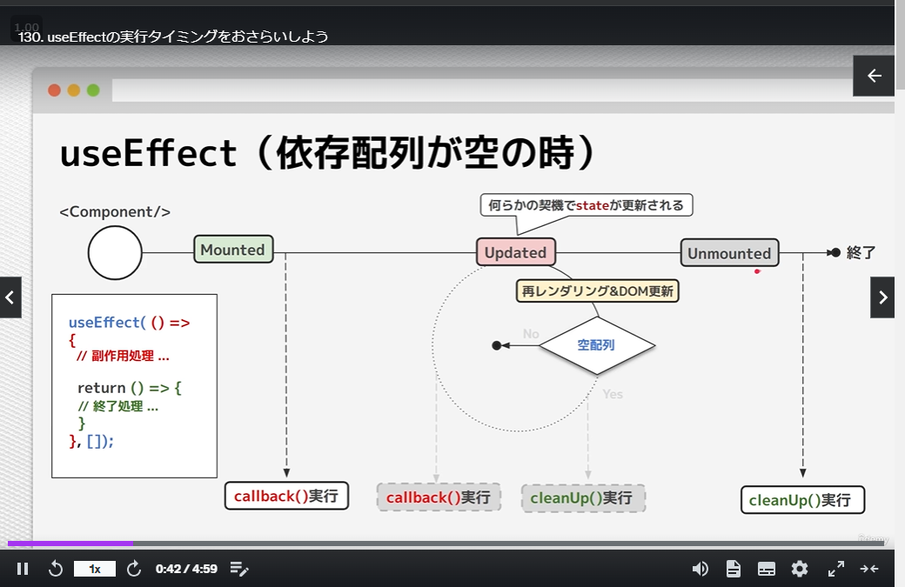
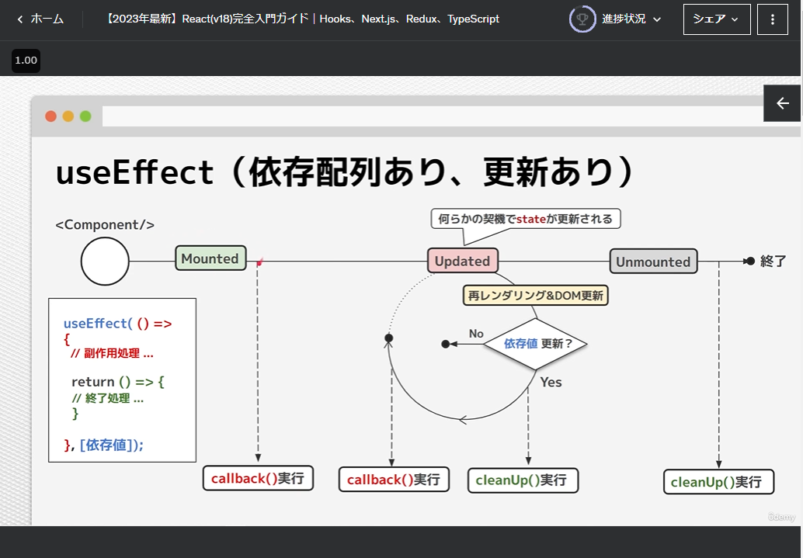

[to TopPage](../README.md)

# 12_【ReactHooks】useEffectとカスタムフック

## 講座一覧
- [125_セクション紹介](#125_セクション紹介)
- [126_useEffectとは？タイマーを作りながら学んでみよう](#126_useeffectとはタイマーを作りながら学んでみよう)
- [127_useEffectの依存配列の使い方](#127_useeffectの依存配列の使い方)
- [128_【練習&解答】useEffect](#128_練習解答useeffect)
- [129_useEffectのクリーンアップ処理の使い方](#129_useeffectのクリーンアップ処理の使い方)
- [130_useEffectの実行タイミングをおさらいしよう](#130_useeffectの実行タイミングをおさらいしよう)
- [131_useLayoutEffectって何？useEffectとの違いについて学ぼう](#131_uselayouteffectって何useeffectとの違いについて学ぼう)
- [132_useEffectの実行順を意識して実装してみよう](#132_useeffectの実行順を意識して実装してみよう)
- [133_独自のフックを作成してみよう](#133_独自のフックを作成してみよう)
- [134_【練習&解答】Custom−Hook](#134_練習解答custom−hook)
- [135_【発展】関数型プログラミングから見たuseEffectの使用ケース](#135_発展関数型プログラミングから見たuseeffectの使用ケース)


## 125_セクション紹介
[toTop](#)

- この章では、`useEffect` Hookと自作Hook（カスタムフック）の作成方法を紹介

## 126_useEffectとは？タイマーを作りながら学んでみよう
[toTop](#)

- `useEffect`の役割：コンポーネント内の処理を制御する
- `useEffect`の定義：
```jsx
import { useEffect, useState } from "react";

const Example = () => {
  const [time, setTime] = useState(0);
  // useEffect(() => { 処理 }, 更新タイミング([]の場合は１回だけ実行))
  useEffect(() => {
    console.log('useEffect is called');
    window.setInterval(() => {
      setTime(prev => prev + 1);
    }, 1000);
  }, [])
```

### ソースコード
- [end source](./src/010_useEffect_init/end/Example.jsx)
- エントリーコンポーネント：
```jsx
// POINT useEffectの基礎
import { useEffect, useState } from "react";

const Example = () => {
  const [time, setTime] = useState(0);

  useEffect(() => {
    console.log('useEffect is called');
    window.setInterval(() => {
      setTime(prev => prev + 1);
    }, 1000);
  }, [])

  return (
    <h3>
      <time>{time}</time>
      <span>秒経過</span>
    </h3>
    );
};

export default Example;
```


## 127_useEffectの依存配列の使い方
[toTop](#)

- `useEffect`の第２引数の役割を紹介
  * 第２引数は、「依存配列」と呼ばれ、実行タイミング（発火対象の変数）を指定する
  * １回だ実行したい場合は、`[]`（空配列）を指定
  * useEffect注意点：依存値はuseEffect内で更新しない

### ソースコード
- [end source](./src/020_useEffect_update/end/Example.jsx)
- エントリーコンポーネント：
```jsx
// POINT useEffectの依存配列
import { useEffect, useState } from "react";

const Example = () => {
  const [time, setTime] = useState(0);

  useEffect(() => {
    console.log('useEffect is called');
    window.setInterval(() => {
      setTime(prev => prev + 1);
    }, 1000);
  }, [])

  useEffect(() => {
    document.title = 'counter:' + time;
    window.localStorage.setItem('time-key-end', time)
    // POINT useEffect注意点：依存値はuseEffect内で更新しない
    // setTime(prev => prev + 1);
  }, [time]);

  return (
    <h3>
      <time>{time}</time>
      <span>秒経過</span>
    </h3>
    );
};

export default Example;
```

## 128_【練習&解答】useEffect
[toTop](#)

### 練習問題
- 記述を変更し、完成コードのように、useEffectを用いて実装してください。
  * checkedがtrueの場合のみalertで「checked!」と表示されるようにしてください。
- [start source](./src/025_practice_useEffect/start/Example.jsx)
- エントリーコンポーネント：
```jsx
import { useState } from 'react';

const Example = () => {
  const [checked, setChecked] = useState(false);

  return (
    <>
      <h3>練習問題</h3>
      <p>
        記述を変更し、完成コードのように、checkedがtrueの場合のみalertで「checked!」と表示されるようにしてください。useEffectを用いて実装してください。
      </p>
      <label>
        <input type={'checkbox'} value={checked} onClick={() => setChecked((checked) => !checked)} />
        click me
      </label>
    </>
  );
};

export default Example;
```

### 試行案：
```jsx
import { useState, useEffect } from 'react';

const Example = () => {
  const [checked, setChecked] = useState(false);

  useEffect(() => {
    // if (checked) alert('checked!'); // もしくは
    checked && window.alert("checked!");
  }, [checked]);

  return (
    <>
      <h3>練習問題</h3>
      <p>
        記述を変更し、完成コードのように、checkedがtrueの場合のみalertで「checked!」と表示されるようにしてください。useEffectを用いて実装してください。
      </p>
      <label>
        <input type={'checkbox'} value={checked} onClick={() => setChecked((checked) => !checked)} />
        click me
      </label>
    </>
  );
};

export default Example;
```

### ソースコード
- [end source](./src/025_practice_useEffect/end/Example.jsx)
- エントリーコンポーネント：
```jsx
// POINT useEffectの練習

import { useState, useEffect } from "react";

const Example = () => {
  const [checked, setChecked] = useState(false);

  useEffect(() => {
    checked && window.alert("checked!");
  }, [checked]);

  return (
    <label>
      <input
        type={"checkbox"}
        value={checked}
        onClick={() => setChecked((checked) => !checked)}
      />
      click me
    </label>
  );
};

export default Example;
```

## 129_useEffectのクリーンアップ処理の使い方
[toTop](#)

- `useEffect`の`return`文について解説
  * 連続して呼び出されるuseEffectは、処理が一度完了（`return`）した後に次の呼び出しが処理される
  * `return`文はコールバック関数で書くと、コールバック関数内で終了処理を実装できる

### 利用ケース
- 下のように`useEffect`の場合、CallBack実行毎に `setInterval`を作成するので、メモリリークにつながる
  * ⇒ なので、`return`文で`clearInterval`を呼び出してメモリを解放する
```jsx
const Timer = () => {
  const [time, setTime] = useState(0);

  useEffect(() => {
    // console.log('init');
    let intervalId = null;
    intervalId = window.setInterval(() => {
      console.log('interval called');
      setTime(prev => prev + 1);
    }, 1000);
    return () => {
      window.clearInterval(intervalId)
      // console.log('end');
    }
  }, [])
```

### ソースコード
- [end source](./src/030_useEffect_cleanup/end/Example.jsx)
- エントリーコンポーネント：
```jsx
// POINT useEffectのクリーンアップ処理

import { useEffect, useState } from "react";
const Example = () => {
  const [isDisp, setIsDisp] = useState(true);

  return (
    <>
      {isDisp && <Timer/>}
      <button onClick={() => setIsDisp(prev => !prev)}>トグル</button>
    </>
  )
}
const Timer = () => {
  const [time, setTime] = useState(0);

  useEffect(() => {
    // console.log('init');
    let intervalId = null;
    intervalId = window.setInterval(() => {
      console.log('interval called');
      setTime(prev => prev + 1);
    }, 1000);
    return () => {
      window.clearInterval(intervalId)
      // console.log('end');
    }
  }, [])

  useEffect(() => {
    // console.log('updated');
    document.title = 'counter:' + time;
    window.localStorage.setItem('time-key-end', time);

    return () => {
      // debugger
      // console.log('updated end');
    }
  }, [time]);

  return (
    <h3>
      <time>{time}</time>
      <span>秒経過</span>
    </h3>
    );
};

export default Example;
```

## 130_useEffectの実行タイミングをおさらいしよう
[toTop](#)

- `useEffect`とMVCのライフサイクルと比べて動作を確認する
  * `Mounted`⇒`Updated`⇒`Unmounted`に沿って、**Callback()実行⇒CleanUp()実行を繰り返し行う**
  * `Mounted`のCallBackのCleanUpは`Unmounted`の時に実行される

| 依存関係ない`useEffect` | 依存関係ある`useEffect` |
|-----|-----|
|-----|-----|
|  |  |


### ソースコード
- [end source](./src/040_useEffect_lifecycle/end/Example.jsx)
- エントリーコンポーネント：
```jsx
// POINT useEffectの実行タイミング
import { useState, useEffect } from "react";

const Example = () => {
  const [state, setState] = useState(0);

  useEffect(
    function update() {
      console.log("update");

      return function cleanUp() {
        console.log("update cleanup");
      };
    },
    [state]
  );

  useEffect(() => {
    console.log("mount");

    return () => {
      console.log("mount cleanup");
    };
  }, []);

  console.log("render");

  return (
    <>
      <button onClick={() => setState((prev) => prev + 1)}>更新</button>
      <h3>他のレクチャーを選ぶとunmountが呼ばれます。</h3>
    </>
  );
};

export default Example;
```

#### コンソールログの進み方
* `Mounted`のCallBackのCleanUpは`Unmounted`の時に実行される
```
mount	Example.js:27
render	Example.js:13
update cleanup	Example.js:10
update	Example.js:27
...
render	Example.js:13
update cleanup	Example.js:10
update	Example.js:13
update cleanup	Example.js:23
mount cleanup	Example.js:19
```

## 131_useLayoutEffectって何？useEffectとの違いについて学ぼう
[toTop](#)

- `useLayoutEffect`は、基本的に`useEffect`と同じように動作する
  * 違いは、`useLayoutEffect`は`useEffect`より先に実行される点

### ソースコード
- [end source](./src/050_useLayoutEffect/end/Example.jsx)
- エントリーコンポーネント：
```jsx
import { useEffect, useState, useLayoutEffect } from "react";

// POINT useLayoutEffectとは？useEffectとの違い
const Example = () => {
  const [isDisp, setIsDisp] = useState(true);

  return (
    <>
      {isDisp && <Timer/>}
      <button onClick={() => setIsDisp(prev => !prev)}>トグル</button>
    </>
  )
}

const Timer = () => {
  const [time, setTime] = useState(0);

  useEffect(() => {
    // console.log('init');
    let intervalId = null;
    intervalId = window.setInterval(() => {
      setTime(prev => prev + 1);
    }, 1000);
    return () => {
      window.clearInterval(intervalId)
      // console.log('end');
    }
  }, [])

  useEffect(() => {
    // console.log('updated');
    
    document.title = 'counter:' + time;
    window.localStorage.setItem('time-key-end', time);

    return () => {
      // debugger
      // console.log('updated end');
    }
  }, [time]);

  useLayoutEffect(() => {
    const _time = parseInt(window.localStorage.getItem('time-key-end'));
    if(!isNaN(_time)) {
      setTime(_time);
    }
  }, [])

  return (
    <h3>
      <time>{time}</time>
      <span>秒経過</span>
    </h3>
    );
};

export default Example;
```

## 132_useEffectの実行順を意識して実装してみよう
[toTop](#)

- 前セクションの`Timer`コンポーネントを拡張して、`useEffect`の実行順を学ぶ

### ソースコード
- [end source](./src/060_useEffect_click/end/Example.jsx)
- エントリーコンポーネント：
```jsx
import { useEffect, useState, useLayoutEffect } from "react";

// POINT  useEffectの実行順を意識した実装。タイマー機能の拡張
const Example = () => {
  const [isDisp, setIsDisp] = useState(true);

  return (
    <>
      {isDisp && <Timer/>}
      <button onClick={() => setIsDisp(prev => !prev)}>{isDisp ? '非表示' : '表示'}</button>
    </>
  )
}

const Timer = () => {
  const [time, setTime] = useState(0);
  const [isRunning, setIsRunning] = useState(false);

  useEffect(() => {
    // console.log('init');
    let intervalId = null;

    if(isRunning) {
      // console.log('timer start');

      intervalId = window.setInterval(() => {
        // console.log('interval running');
        setTime(prev => prev + 1);
      }, 1000);
    }

    return () => {
      window.clearInterval(intervalId)
      // console.log('end');
    }
  }, [isRunning])
  
  useEffect(() => {
    // // console.log('updated');
    
    document.title = 'counter:' + time;
    window.localStorage.setItem('time-key-end', time);

    return () => {
      // debugger
      // // console.log('updated end');
    }
  }, [time]);

  useLayoutEffect(() => {
    const _time = parseInt(window.localStorage.getItem('time-key-end'));
    if(!isNaN(_time)) {
      setTime(_time);
    }
  }, [])

  const toggle = () => {
    setIsRunning(prev => !prev);
  }

  const reset = () => {
    setTime(0);
    setIsRunning(false);
  }

  return (
    <>
    <h3>
      <time>{time}</time>
      <span>秒経過</span>
    </h3>
    <div>
      <button onClick={toggle}>{isRunning ? '一時停止' : 'スタート'}</button>
      <button onClick={reset}>リセット</button>
    </div>
    </>
    );
};

export default Example;
```


## 133_独自のフックを作成してみよう
[toTop](#)

- 独自のフック（カスタムフック）は、`useState`などのReact Hookを内部で使用している関数（フック）
  * 例えば、同じステート名の`useState`を複数コンポーネントで使いまわしたいときに利用
  * 複数のReact Hook を組み合わせて利用する場合
- [サンプルコード](./src/070_customHook/end/Example.js)


## 134_【練習&解答】Custom−Hook
[toTop](#)

- [サンプルコード（問題）](./src/075_practice_customHook/start/Example.js)
- [サンプルコード（解答）](./src/075_practice_customHook/end/Example.js)

## 135_【発展】関数型プログラミングから見たuseEffectの使用ケース
[toTop](#)

- `useEffect`を、関数型プログラミングの**副作用**の観点から解説
  * これから、`useEffect`内では何を定義したほうが良いか？を理解する
  * Reactにおける副作用は、JSXの構築に関係ないものはすべて副作用として扱われる
    * `console.log`、DOM操作、サーバーとの通信、タイマー処理、ランダム値生成など
    * これらはすべて **（副作用のある処理すべて）を`useEffect`　もしくは　イベントハンドラで定義する**

<br>

- [サンプルコード](./src/080_useEffect_fn_prog/end/Example.js)
```jsx
import { useState, useEffect, useLayoutEffect } from "react";

// 機能的な観点
// コンポーネントマウント時、更新時のみ呼び出したい。

// 純粋関数の観点
// コンソールへのログ出力
// DOM操作
// サーバーとの通信
// タイマー処理
// ランダムな値の生成

const Example = () => {
  const [ isDisp, setIsDisp ] = useState(true);

  return (
    <>
      {isDisp && <Timer/>}
      <button onClick={() => setIsDisp(prev => !prev)}>{isDisp ? '非表示' : '表示'}</button>
    </>
  )
}

const Timer = () => {
  const [time, setTime] = useState(0);
  const [isRunning, setIsRunning] = useState(false);

  useEffect(() => {
    // console.log('init');
    let intervalId = null;

    if(isRunning) {
      // console.log('timer start');

      intervalId = window.setInterval(() => {
        // console.log('interval running');
        setTime(prev => prev + 1);
      }, 1000);
    }
    
    return () => {
      window.clearInterval(intervalId)
      // console.log('end');
    }
  }, [isRunning])
  
  useEffect(() => {
    // // console.log('updated');
    
    document.title = 'counter:' + time;
    window.localStorage.setItem('time-key-end', time);

    return () => {
      // debugger
      // // console.log('updated end');
    }
  }, [time]);

  useLayoutEffect(() => {
    const _time = parseInt(window.localStorage.getItem('time-key-end'));
    if(!isNaN(_time)) {
      setTime(_time);
    }
  }, [])

  const toggle = () => {
    setIsRunning(prev => !prev);
  }

  const reset = () => {
    setTime(0);
    setIsRunning(false);
  }

  return (
    <>
    <h3>
      <time>{time}</time>
      <span>秒経過</span>
    </h3>
    <div>
      <button onClick={toggle}>{isRunning ? '一時停止' : 'スタート'}</button>
      <button onClick={reset}>リセット</button>
    </div>
    </>
    );
};

export default Example;
```
