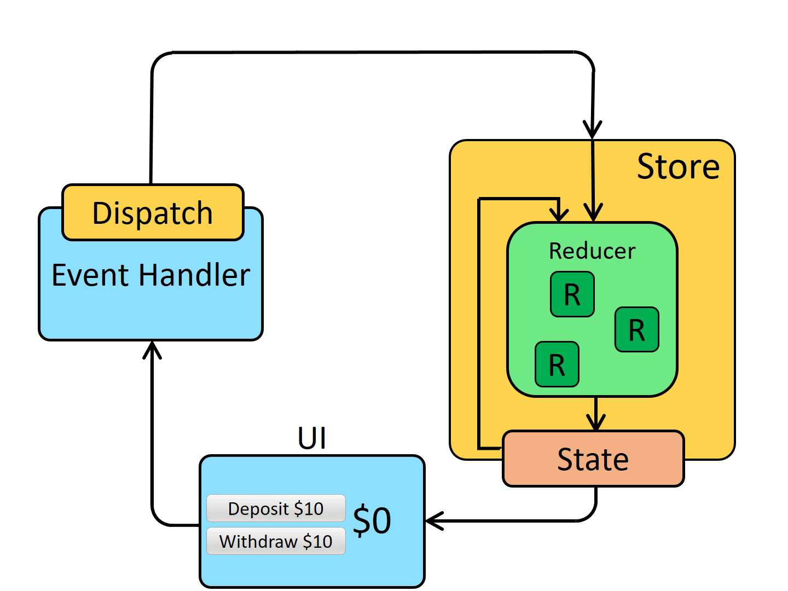
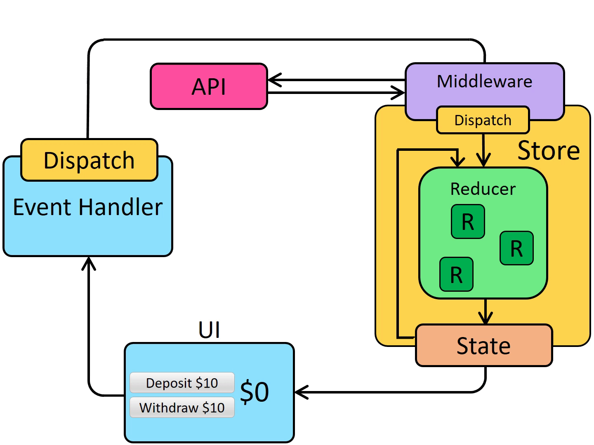

[to TopPage](../README.md)

# 13_【発展】ReduxとReduxToolkit

## 講座一覧
- [136_セクション紹介](#136_セクション紹介)
- [137_Reduxとグローバルな状態管理](#137_reduxとグローバルな状態管理)
- [138_★本セクションのサンプルコードの実行方法](#138_★本セクションのサンプルコードの実行方法)
- [139_Reduxを使ってみよう](#139_reduxを使ってみよう)
- [140_Reduxの状態管理方法について学ぼう](#140_reduxの状態管理方法について学ぼう)
- [141_複数のReducerを使う方法](#141_複数のreducerを使う方法)
- [142_Action−CreatorでActionを定義してみよう](#142_action−creatorでactionを定義してみよう)
- [143_Redux−ToolkitでReduxを書き換えてみよう](#143_redux−toolkitでreduxを書き換えてみよう)
- [144_Redux−Toolkitにおけるミュータブルな値の変更](#144_redux−toolkitにおけるミュータブルな値の変更)
- [145_Immerを使ったミュータブルな値の変更](#145_immerを使ったミュータブルな値の変更)
- [146_Redux−Thunkとは？Redux−Middlewareとの関係](#146_redux−thunkとはredux−middlewareとの関係)
- [147_Redux−Thunkで非同期処理を記述してみよう](#147_redux−thunkで非同期処理を記述してみよう)
- [148_非同期処理のステータスを画面に表示してみよう](#148_非同期処理のステータスを画面に表示してみよう)
- [149_Redux−Middlewareを作成してみよう](#149_redux−middlewareを作成してみよう)
- [150_セクションまとめ](#150_セクションまとめ)


## 136_セクション紹介
[toTop](#)

- `Redux` の追加い方を紹介
  * `Redux` は、React と一緒に使われることが多い、状態管理を行うライブラリ

## 137_Reduxとグローバルな状態管理
[toTop](#)

- **Redux**とは別の状態管理のためのライブラリ
  * React以外とも組み合わせて使用可能
  * Reactと利用する場合、`react-redux`パッケージもインストールする
- **Redux Toolkit（RTK）**とは、公式で推奨する設定やコーディングをまとめたもの
  * 素のReduxはほかのライブラリで補強するケースが多いため、それらを１パッケージにした
  * RTKが含むもの、`Redux(?)`、`Immer`、`redux-thunk`, `createSlice`など
  * 本セクションでもRTK を利用する

<br>

### ステート（状態管理）
- グローバルステート
  * アプリ全体で共有されるステート
  * `useContext`があった
  * Reduxもグローバルステートを扱う

#### `useContext`を利用する場合
- rootコンポーネントで、stateを`<Context.Provider />で囲むと`React.createContext()`で共有ステート作成
  * 子コンポーネントで、`useContext()`で共有ステートを読み出す
  * 子コンポーネントで、`useReducer()`で共有ステートを更新する

#### Reduxを利用する場合
- rootコンポーネントで、stateを`<Provider />で囲むと`configureStore()`で共有ステート作成
  * 子コンポーネントで、`useSelector()`で共有ステートを読み出す
  * 子コンポーネントで、`useDispatch()`で共有ステートを更新する
  * Reduxの方が、`useContext()`や`useReducer()`よりパフォーマンスが良い


## 138_★本セクションのサンプルコードの実行方法
[toTop](#)

### パッケージインストール＆スタート
```sh
cd 13_redux/end
pnpm i
pnpm start
```

#### 既存のReactアプリにインストールする場合
```sh
# If you use npm:
pnpm install @reduxjs/toolkit react-redux -S
```

### 講義のコードに切り替える方法
- **App.js**で、`import`文のコメントアウト・コメントなしの行をかえる
```jsx
import "./App.css";

import Example from "./010_redux_no_rtk/Example"; // 次節用のコード
// import Example from "./015_multiple_reducers/Example";
// import Example from "./020_actionCreator/Example";
// import Example from "./030_redux_toolkit/Example";
// import Example from "./040_immer/Example";
// import Example from "./050_redux_thunk/Example";
// import Example from "./060_createAsyncThunk/Example";
// import Example from "./070_middleware/Example";
...
```

### 参考）`start`フォルダの構築コマンド

```sh
export TARGET_DIRNAME="13_redux"
cd $TARGET_DIRNAME
npm create vite@latest start -- --template react
# sometime need to answer to inquiry proceed
#
cd start
rm -rf src
cp -r ../../00_references/99_react-guide-material/${TARGET_DIRNAME}/start/src .
# cp -r ../00_references/11_Udemy_React18-complete-guide/04_react_basic/README.md .
mv src/index.js src/main.jsx
pnpm i
pnpm i web-vitals -D
pnpm i redux react-redux @reduxjs/toolkit immer -S
pnpm run dev
# find src -name "*.js" -print
for filename in ` find src -name "*.js" -print ` ; do ls $filename;  modFilename=`echo $filename |  sed -e "s/.js/.jsx/" `; mv $filename $modFilename ; done
for filename in ` find src -name "*.js" -print ` ; do ls $filename; done
pnpm run dev
#
# convert to UTF file
for filename in `find src -name "*.jsx"` ; do ls $filename; nkf_to_utffile $filename; done
for filename in `find src -name "*.css"` ; do ls $filename; nkf_to_utffile $filename; done
#
```


## 139_Reduxを使ってみよう
[toTop](#)

* Redux Took Kit（RTK）を利用しない`Redux`の利用方法を紹介
  * 現在はRTK 利用が主流なので、参考として紹介
  * 講義では、`useContext`（Context Privider）利用からの変更として紹介

### ソースコード
- [end source](./end/src/010_redux_no_rtk/Example.jsx)
- エントリーコンポーネント：
```jsx
// POINT 素のReduxでグローバルな状態管理を記述してみよう
import Counter from "./components/Counter";
import { Provider } from "react-redux";
import store from "./store"

const Example = () => {
  return (
    <Provider store={store}>
      <Counter />
    </Provider>
  );
};

export default Example;
```

- `store`モジュール：
  - まずステートを定義する
```jsx
import { createStore } from "redux"; // `createStore` is already deprecated.

const initialState = 0;
// `reducer`の登録：
// * 第一引数：状態
// * 第二引数：アクション
const reducer = (state = initialState, { type, step }) => {
    switch (type) {
      case "+":
        return state + step;
      case "-":
        return state - step;
      default:
        return state;
    }
  };

export default createStore(
    reducer
);
```

- `Counter`コンポーネント：
```jsx
import CounterResult from "./CounterResult"
import CounterButton from "./CounterButton"

const Counter = () => {
    return (
        <>
            <CounterResult />
            <CounterButton step={2} calcType="+"/>
            <CounterButton step={2} calcType="-"/>
            <CounterButton step={10} calcType="+"/>
            <CounterButton step={10} calcType="-"/>
        </>
    )
}
export default Counter;
```

- `CounterResult`コンポーネント：
  - ステートの参照は、`useSelector`を利用する
```jsx
// 2023/10 存在しないファイルのimportでエラーが出るため修正
// 使用していないCounterContextのimport削除

import { useSelector } from "react-redux"
const CounterResult = () => {
  const state = useSelector(state => state);
  return <h3>{state}</h3>;
};

export default CounterResult;
```

- `CounterButton`コンポーネント：
  - ステートの更新は、`useDispatch`を利用する
```jsx
import { useDispatch } from "react-redux";
// 使用していないCounterContextのimport削除

const CounterButton = ({calcType, step}) => {

    const dispatch = useDispatch();
    // const dispatch = useCounterDispatch();

    const clickHandler = () => {
        dispatch({ type: calcType, step });
    }

    return <button onClick={clickHandler}>{calcType}{step}</button>
}
export default CounterButton;
```


## 140_Reduxの状態管理方法について学ぼう
[toTop](#)

- [Redux Fundamentals, Part 2: Concepts and Data Flow](https://redux.js.org/tutorials/fundamentals/part-2-concepts-data-flow#redux-application-data-flow)の動画がReduxの動作を表している

| Stateから共有ステートを読み出す | Stateの更新はReducerで行う |
|-----|-----|
| `useSelector()`でステート読出し | `useDispatch()`で前stateを参照しながら更新 |
|  |  |

### マフィア先生の解説：
- `Redux`の場合、一つのグローバルストア（`Store`）を提供している
  * グローバルに`Reducer`を登録する（`CreateStore`が該当）
  * `Reducer`は複数登録することができる
  * `Reducer`からステート（`State`）を読み出す
- 読み出した`State`を、UI上で新たな状態に更新して、`Dispatch`を通して`Store`を更新する


## 141_複数のReducerを使う方法
[toTop](#)

- ステートの内容はオブジェクトを定義して、オブジェクトプロパティ毎に`reducer`を定義できる
  * ステート定義の最後に、`combineReducers`で統合する

### ソースコード
- [end source](./end/src/015_multiple_reducers/Example.jsx)
- エントリーコンポーネント：
```jsx
// POINT Reduxで複数のReducerを使う方法
import Counter from "./components/Counter";
import { Provider } from "react-redux";
import store from "./store"

const Example = () => {
  return (
    <Provider store={store}>
      <Counter />
    </Provider>
  );
};

export default Example;
```

- `store`モジュール：
```jsx
import { createStore, combineReducers } from "redux";

const initialState = 0;
const reducer = (state = initialState, { type, step }) => {
  console.log(type);
  switch (type) {
    case "counter/+":
      return state + step;
    case "counter/-":
      return state - step;
    default:
      return state;
  }
};

// ２つ目の`Reducer`
const reducer2 = (state = initialState, { type, step }) => {
  console.log(type);
  switch (type) {
    case "counter2/+":  // 更新するときは、`type: "counter2/+"` としてdispatchする
      return state + step;
    case "counter2/-":
      return state - step;
    default:
      return state;
  }
};

// ２つの`Reducer`を統合する
const reducers = combineReducers({
  counter: reducer,   // 外部から暗唱するときは、`state.counter`で参照
  counter2: reducer2,   // 外部から暗唱するときは、`state.counter2`で参照
});

export default createStore(reducers);
```

- `Counter`コンポーネント：
```jsx
import CounterResult from "./CounterResult"
import CounterButton from "./CounterButton"

const Counter = () => {
    return (
        <>
            <CounterResult />
            <CounterButton step={2} calcType="+"/>
            <CounterButton step={2} calcType="-"/>
            <CounterButton step={10} calcType="+"/>
            <CounterButton step={10} calcType="-"/>
        </>
    )
}
export default Counter;
```

- `CounterResult`コンポーネント：
```jsx
import { useSelector } from "react-redux"
const CounterResult = () => {
  // const state = useCounter();
  const state = useSelector(state => state); // Reducerを呼び出し
  console.log(state);
  return <h3>{state.counter}:{state.counter2}</h3>; // reducer2 から参照
};

export default CounterResult;
```

- `CounterButton`コンポーネント：
  - `state.counter`と`state.counter2`は独立して操作できる
  + `dispatch(useDispatch)`で、`type: 'counter2/'`として、`state.counter2`のみを更新させている
```jsx
import { useDispatch } from "react-redux";

const CounterButton = ({calcType, step}) => {
    
    const dispatch = useDispatch();
    // const dispatch = useCounterDispatch();
    
    const clickHandler = () => {
        dispatch({ type: 'counter2/' + calcType, step });
    }

    return <button onClick={clickHandler}>{calcType}{step}</button>
}
export default CounterButton;
```

## 142_Action−CreatorでActionを定義してみよう
[toTop](#)

* `Action-Creator`とは、アクションを作成する関数のこと
  * 処理を関数で定義することでミスの少ない`reducer`を実装できる
  * `reducer`部分を別モジュールで定義する
    * 定義するときは、一般的に引数`payload`と定義する
  * `Action-Creator`では、`dispatch`のエントリーを別関数として定義する
    * RTKでは、`Action-Creator`の関数定義を自動実施される

### ソースコード
- [end source](./end/src/020_actionCreator/Example.jsx)
- エントリーコンポーネント：
```jsx
// POINT Action CreatorとActionの関係
import Counter from "./components/Counter";
import { Provider } from "react-redux";
import store from "./store"

const Example = () => {
  return (
    <Provider store={store}>
      <Counter />
    </Provider>
  );
};

export default Example;
```

- `store`モジュール：
```jsx
import { createStore, combineReducers } from "redux";
import { reducer } from "./modules/counter"

const reducers = combineReducers({
  counter: reducer,
});

export default createStore(reducers);
```

- `reducer`モジュール：
```jsx
const initialState = 0;

// `reducer`定義の本体
const reducer = (state = initialState, { type, payload }) => {
  switch (type) {
    case "counter/+":
      return state + payload;
    case "counter/-":
      return state - payload;
    default:
      return state;
  }
};

// `reducer`を呼び出すエントリーの関数を定義
// - `Action-Create`により、自動的に`dispatch({ type: 'counter/+', payload})が呼ばれる
const add = (payload) => {
    return {
        type: "counter/+",
        // payload: payload
        payload // プロパティ名と値が同盟の時は省略できる
    }
}

const minus = (payload) => {
    return {
        type: "counter/-",
        payload
    }
}

export { reducer, add, minus }
```

- `Counter`コンポーネント：
```jsx
import CounterResult from "./CounterResult"
import CounterButton from "./CounterButton"

const Counter = () => {
    return (
        <>
            <CounterResult />
            <CounterButton step={2} calcType="+"/>
            <CounterButton step={2} calcType="-"/>
            <CounterButton step={10} calcType="+"/>
            <CounterButton step={10} calcType="-"/>
        </>
    )
}
export default Counter;
```

- `CounterResult`コンポーネント：
```jsx
import { useSelector } from "react-redux"
const CounterResult = () => {
  const state = useSelector(state => state);
  return <h3>{state.counter}</h3>;
};

export default CounterResult;
```

- `CounterButton`コンポーネント：
```jsx
import { useDispatch } from "react-redux";
import { add, minus } from "../store/modules/counter"

const CounterButton = ({calcType, step}) => {

    const dispatch = useDispatch();

    const clickHandler = () => {
        const action = calcType === '+' ? add(step) : minus(step);
        console.log(action)
        dispatch(action);
    }

    return <button onClick={clickHandler}>{calcType}{step}</button>
}
export default CounterButton;
```

## 143_Redux−ToolkitでReduxを書き換えてみよう
[toTop](#)

* Redux Toolkit（RTK）による、Reduxの推奨実装方法を紹介
  * RTK を使うことで、非推奨関数（`createStore`など）の利用を回避できる

### RTK 利用の前準備
- RTK に関連するパッケージを追加
```sh
# pnpm i redux react-redux @reduxjs/toolkit immer -S
pnpm i react-redux @reduxjs/toolkit immer -S
```

### ソースコード
- [end source](./end/src/030_redux_toolkit/Example.jsx)
- エントリーコンポーネント：
```jsx
// POINT Redux Toolkitの使い方
import Counter from "./components/Counter";
import { Provider } from "react-redux";
import store from "./store"

const Example = () => {
  return (
    <Provider store={store}>
      <Counter />
    </Provider>
  );
};

export default Example;
```

- `store`モジュール：
  * `@reduxjs/toolkit`（RTK ）から、`configureStore`をインポート
  * ストアの定義は、`configureStore()`で定義
    + 引数にオブジェクトで、`reducer`のオブジェクトを定義
```jsx
import { configureStore } from "@reduxjs/toolkit";
import reducer from "./modules/counter";

export default configureStore({
  reducer: {
    counter: reducer
  }
});
```

- `reducer`モジュール：
  * Redux とは異なり、`Action Creator`の関数名として定義する
  * `createSlice`をインポートして、`reducer`を定義する
    * `name`, `initialState`, `reducers`を指定する
    * `reducers`は、予め複数`Reducer`を定義することを想定している
```jsx
import { createSlice } from "@reduxjs/toolkit";

const counter = createSlice({
  name: 'counter',
  initialState: 0,
  reducers: {
    add(state, { type, payload }) {
      console.log(type, payload)
      return state + payload;
    },
    minus(state, { type, payload }) {
      console.log(type, payload)
      return state - payload;
    }
  }
})


// Action Creatorの関数には、`createSlice`オブジェクトの`actions`プロパティを定義する
// - どうも、ここの`actions`の内容が自動的に作成されてるようだ
const { add, minus } = counter.actions;

// `Reducer`と`Action Creator`を外部から参照できるようにする`
export { add, minus }
export default counter.reducer
```


- `Counter`コンポーネント：
```jsx
import CounterResult from "./CounterResult"
import CounterButton from "./CounterButton"

const Counter = () => {
    return (
        <>
            <CounterResult />
            <CounterButton step={2} calcType="+"/>
            <CounterButton step={2} calcType="-"/>
            <CounterButton step={10} calcType="+"/>
            <CounterButton step={10} calcType="-"/>
        </>
    )
}
export default Counter;
```

- `CounterResult`コンポーネント：
  * ステートの参照は、`Redux`と同様に、`useSelector`オブジェクトから参照する
```jsx
import { useSelector } from "react-redux"
const CounterResult = () => {
  const state = useSelector(state => state);
  return <h3>{state.counter}</h3>;
};

export default CounterResult;
```

- `CounterButton`コンポーネント：
  * ステート更新（`Dispatch`）は、`Action Creator`の関数を呼び出し
  * `useDispatch`オブジェクトで更新する
```jsx
import { useDispatch } from "react-redux";
import { add, minus } from "../store/modules/counter"

const CounterButton = ({calcType, step}) => {
    
    const dispatch = useDispatch();
    console.log(add(step))
    const clickHandler = () => {
        const action = calcType === '+' ? add(step) : minus(step);
        console.log(action)
        dispatch(action);
    }

    return <button onClick={clickHandler}>{calcType}{step}</button>
}
export default CounterButton;
```

## 144_Redux−Toolkitにおけるミュータブルな値の変更
[toTop](#)

- `Reducer`定義における、初期状態（`initialState`）がオブジェクトや配列だった場合の留意点を紹介
- 下のような定義をしたときに注意する
- `reducer`モジュール：
  * サンプルコードでは、`initialState: 0`で値を定義しているのでイミュータブル
  * `initialState: { count: 0 }`のような場合には実装に留意点がある
  * 理由は、`Redux`においても純粋関数のルール（Immutability の保持）が推奨されるため
```jsx
import { createSlice } from "@reduxjs/toolkit";

const counter = createSlice({
  name: 'counter',
  // initialState: 0,
  initialState: {
    count: 0,
  },
  reducers: {
    add(state, { type, payload }) {
      console.log(type, payload)
      // return state + payload;
      // // ステート更新を明示的に実装する場合、新たなステートを定義して更新する
      // const newState = { ...state };
      // newState.count = state.count + payload;
      // return newState;
      //
      // ただし、RTK ではミュータブルな処理もイミュータブルに変えてくれる機能がある
      // 上記のオブジェクトの定義を、下のように変更することができる
      state.count = state.count + payload; // RTK により実装できる書き方
      // オブジェクトプロパティ更新（ミュータブル操作）を書ける。
      // RTK 内の`Immer`により、イミュータブルな処理に補正されて実行される
    },
    minus(state, { type, payload }) {
      console.log(type, payload)
      // return state - payload;
      const newState = { ...state };
      newState.count = state.count - payload
      return newState
    }
  }
})
```

## 145_Immerを使ったミュータブルな値の変更
[toTop](#)
- Reduxは純粋関数なので、ステートを調節書き換えることはできない
  * 「イミュータブルの保持」が求められる
  * Immerを使うことで、ステートの書き換えを行えるようにする
  * 注意点：Immerを使うときは、`return`を付けない
    * 理由は、オブジェクト内部を変えた時、新たなオブジェクトが作られてるため
    * （イミュータブルとして処理されている）


### ソースコード
- [end source](./end/src/040_immer/Example.jsx)
- エントリーコンポーネント：
```jsx
// POINT immerでイミュータブルな操作を行う方法
import Counter from "./components/Counter";
import { Provider } from "react-redux";
import store from "./store"
import "./immer";

const Example = () => {
  return (
    <Provider store={store}>
      <Counter />
    </Provider>
  );
};

export default Example;
```

- `immer`モジュール：参考情報
  * `Immer`パッケージの動作を解説するために実装している
```jsx
import { produce } from "immer";

const state = {
    name: 'Tom',
    hobbies: ['tennis', 'soccer']
}

// const newState = state;
// newState.name = 'John';
const newState = produce(state, draft => {
    // draft.name = 'John';
    // draft.hobbies[0] = 'baseball';

    console.log(draft);
    return [];
})

console.log(state, newState)
```

## 146_Redux−Thunkとは？Redux−Middlewareとの関係
[toTop](#)

- Reduxで非同期処理をしたいときに、`Redux-Thunk`を利用する
- Reduxでも純粋関数であることが求められるので、非同期処理は副作用となる
  * そのため、`Redux-Thunk`を使うためには、`Redux−Middleware`という機能を使う

 ①基本のRedux動作構成 | ②`Redux-MiddleWare`利用時の動作構成
 -- | --
  | 

- ポイントは、**`Reducer`の外では非同期処理を実装する**こと

## 147_Redux−Thunkで非同期処理を記述してみよう
[toTop](#)
- `Redux-Thunk`の基本的な使い方として、非同期処理でステートを更新する実装を紹介
- `Redux-Thunk`を使うと、非同期処理でステートを更新できる
  * `Redux-Thunk`は、Redux-MiddleWareのライブラリ
  * `Redux-Thunk`の定義方法は、`Actions-Creator`のように関数を定義する
    * 関数の戻り値として、`dispatch`関数と`getState`関数が返ってくる
```jsx
// const thunkFunction = (payload) => {
//   return (dispatch, getState) => { // getStateは現在の状態を参照できる
//     副作用処理
//   }
// }
```


### ソースコード
- [end source](./end/src/050_redux_thunk/Example.jsx)
- エントリーコンポーネント：
```jsx
import Counter from "./components/Counter";
import { Provider } from "react-redux";
import store from "./store"

// POINT redux-thunkの定義
// const thunkFunction = (payload) => {
//   return (dispatch, getState) => {
//     副作用処理
//   }
// }
const Example = () => {
  return (
    <Provider store={store}>
      <Counter />
    </Provider>
  );
};

export default Example;
```

- `store`モジュール：
```jsx
import { configureStore } from "@reduxjs/toolkit";
import reducer from "./modules/counter";

export default configureStore({
  reducer: {
    counter: reducer
  }
});
```

- `reducer`モジュール：
```jsx
import { createSlice } from "@reduxjs/toolkit";

import { asyncCount } from "../../api/counter"

const counter = createSlice({
  name: 'counter',
  initialState: {
    count: 0
  },
  reducers: {
    add(state, { type, payload }) {
      state.count = state.count + payload;
      // const newState = { ...state };
      // newState.count = state.count + payload
      // return newState;
    },
    minus(state, { type, payload }) {
      state.count = state.count - payload;
      // const newState = { ...state };
      // newState.count = state.count - payload
      // return newState;
    }
  }
});

const { add, minus } = counter.actions;

const addAsync = (payload) => {
  // Redux-Thunkによる、`dispatch`と`getState`の生成
  return async (dispatch, getState) => {
    const state = getState();
    console.log(state);
    const response = await asyncCount(payload);
    dispatch(add(response.data));
  }
}

export { add, minus, addAsync }
export default counter.reducer
```

- `asyncCount`モジュール：
  * 講座のサンプルでは、`Promise`オブジェクトで非同期処理を実装
  * クライアントのみで疑似的に応答するように実装
```jsx
const asyncCount = (count = 1) => {
  return new Promise((resolve) =>
    setTimeout(() => resolve({ data: count }), Math.random() * 1000)
  );
};

export { asyncCount };
```

- `Counter`コンポーネント：
```jsx
// `reducer`モジュールから、Actoin Creatorの関数をインポートする
import { add, minus,addAsync } from "../store/modules/counter"

import CounterResult from "./CounterResult"
import CounterButton from "./CounterButton"

const Counter = () => {
    return (
        <>
            <CounterResult />
            <CounterButton step={2} calcType="+" actionCreator={add}/>
            <CounterButton step={2} calcType="-" actionCreator={minus}/>
            <CounterButton step={2} calcType="非同期(+)" actionCreator={addAsync}/>
        </>
    )
}
export default Counter;
```

- `CounterResult`コンポーネント：
```jsx
import { useSelector } from "react-redux"
const CounterResult = () => {
  const count = useSelector(state => state.counter.count);
  return <h3>{count}</h3>;
};

export default CounterResult;
```

- `CounterButton`コンポーネント：
```jsx
import { useDispatch } from "react-redux";

const CounterButton = ({calcType, step, actionCreator}) => {
    const dispatch = useDispatch();
    const clickHandler = () => {
        // const action = calcType === '+' ? add(step) : minus(step);
        dispatch(actionCreator(step));
    }

    return <button onClick={clickHandler}>{calcType}{step}</button>
}
export default CounterButton;
```

## 148_非同期処理のステータスを画面に表示してみよう
[toTop](#)

- 非同期処理の応答により画面表示を制御する方法を紹介
- 非同期処理の内容を画面に反映させる
  * ポイントは、`reducer`定義で`extraReducers`プロパティを追加定義
  * `extraReducers`内で、oddケースで非同期処理を実装して状態に応じた画面表示を更新する
  * むずかし...

### ソースコード
- [end source](./end/src/060_createAsyncThunk/Example.jsx)
- エントリーコンポーネント：
```jsx
// POINT [createAsyncThunk]非同期処理のステータスを画面に表示
import Counter from "./components/Counter";
import { Provider } from "react-redux";
import store from "./store"

const Example = () => {
  return (
    <Provider store={store}>
      <Counter />
    </Provider>
  );
};

export default Example;
```

- `store`モジュール：
```jsx
import { configureStore } from "@reduxjs/toolkit";
import reducer from "./modules/counter";

export default configureStore({
  reducer: {
    counter: reducer
  }
});
```

- `reducer`モジュール：
```jsx
import { createSlice, createAsyncThunk } from "@reduxjs/toolkit";

import { asyncCount } from "../../api/counter"

const counter = createSlice({
  name: 'counter',
  initialState: {
    count: 0,
    status: ''
  },
  reducers: {
    add(state, { type, payload }) {
      state.count = state.count + payload;
      // const newState = { ...state };
      // newState.count = state.count + payload
      // return newState;
    },
    minus(state, { type, payload }) {
      state.count = state.count - payload;
      // const newState = { ...state };
      // newState.count = state.count - payload
      // return newState;
    }
  },
  // 画面表示のために下を追加する：
  // - 非同期処理の記述のように、oddケース（`.`によるカスケード）で随時表示メッセージを更新
  // - 画面の
  extraReducers: (builder) => {
    builder.addCase(addAsyncWithStatus.pending, (state) => {
      state.status = 'Loading...'
    })
    .addCase(addAsyncWithStatus.fulfilled, (state, action) => {
      state.status = '取得済'
      state.count = state.count + action.payload;
    })
    .addCase(addAsyncWithStatus.rejected, (state) => {
      state.status = 'エラー'
    })
    
  }
});

const { add, minus } = counter.actions;

const addAsyncWithStatus = createAsyncThunk(
  'counter/asyncCount',
  async (payload) => {
    const response = await asyncCount(payload);
    return response.data;
  }
)

const addAsync = (payload) => {
  return async (dispatch, getState) => {
    const state = getState();
    console.log(state);
    const response = await asyncCount(payload);
    dispatch(add(response.data));
  }
}


export { add, minus, addAsync, addAsyncWithStatus }
export default counter.reducer
```

- `asyncCount`モジュール：
```jsx
const asyncCount = (count = 1) => {
  return new Promise((resolve) =>
    setTimeout(() => resolve({ data: count }), Math.random() * 1000)
  );
};

export { asyncCount };
```

- `Counter`コンポーネント：
```jsx
import { useSelector } from "react-redux"
import { add, minus, addAsync, addAsyncWithStatus } from "../store/modules/counter"

import CounterResult from "./CounterResult"
import CounterButton from "./CounterButton"

const Counter = () => {
    const status = useSelector(state => state.counter.status);
    return (
        <>
            <CounterResult />
            <CounterButton step={2} calcType="+" actionCreator={add}/>
            <CounterButton step={2} calcType="-" actionCreator={minus}/>
            <CounterButton step={2} calcType="非同期(+)" actionCreator={addAsync}/>
            <CounterButton step={2} calcType="非同期表示(+)" actionCreator={addAsyncWithStatus}/>
            <h3>{status}</h3>
        </>
    )
}
export default Counter;
```

- `CounterResult`コンポーネント：
```jsx
import { useSelector } from "react-redux"
const CounterResult = () => {
  const count = useSelector(state => state.counter.count);
  return <h3>{count}</h3>;
};

export default CounterResult;
```

- `CounterButton`コンポーネント：
```jsx
import { useDispatch } from "react-redux";

const CounterButton = ({calcType, step, actionCreator}) => {
    
    const dispatch = useDispatch();
    const clickHandler = () => {
        // const action = calcType === '+' ? add(step) : minus(step);
        dispatch(actionCreator(step));
    }

    return <button onClick={clickHandler}>{calcType}{step}</button>
}
export default CounterButton;
```


## 149_Redux−Middlewareを作成してみよう
[toTop](#)

- カスタム（自作）のMiddlewareを作成する方法を紹介
  * 実際は、あまりカスタマイズすることはないので、参考程度に知っておく
  * むずかし...

* 全体ソースは[070_middleware](./end/src/070_middleware/)

### ソースコード
- [end source](./end/src/070_middleware/Example.jsx)
- エントリーコンポーネント：
```jsx
// POINT Redux Middlewareの定義
import Counter from "./components/Counter";
import { Provider } from "react-redux";
import store from "./store"

const reduxMiddleware = (store) => {
  return (next) => {
    return (action) => {
      // 全てのdispatchで行われる処理
      // storeはaction前の状態
      // （store.getState()でステートを取得）
      next(action);
      // storeはaction後の状態
    };
  }
}
const Example = () => {
  return (
    <Provider store={store}>
      <Counter />
    </Provider>
  );
};

export default Example;
```

- `store`モジュール：
```jsx
import { configureStore } from "@reduxjs/toolkit";
import reducer from "./modules/counter";
import logger from "./middleware/logger" // 自作のMiddlewre
export default configureStore({
  reducer: {
    counter: reducer
  },
  // middlewareを追加するためのプロパティ定義
  // `getDefaultMiddlewre`の返り値は配列となる
  middleware: (getDefaultMiddleware) => getDefaultMiddleware().concat(logger)
});
```

- `logger`モジュール：自作Middleware
```jsx
const logger = (store) => {
  return (next) => {
    return (action) => {
      console.log('変更前', action, store.getState())
      next(action);
      console.log('変更後',action, store.getState())
      // storeはaction後の状態
    };
  };
};

export default logger;
```


## 150_セクションまとめ
[toTop](#)

