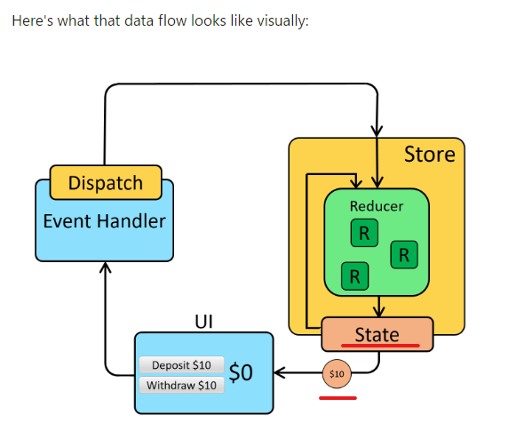
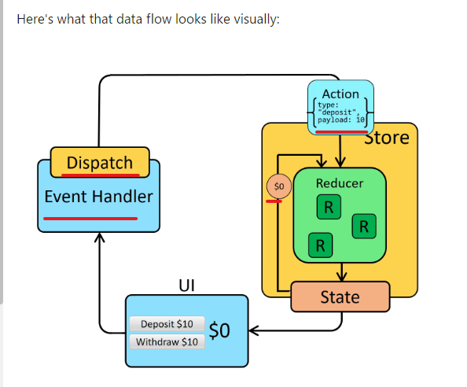

[to TopPage](../README.md)

# 13_【発展】ReduxとReduxToolkit

## 講座一覧
- [136_セクション紹介](#136_セクション紹介)
- [137_Reduxとグローバルな状態管理](#137_Reduxとグローバルな状態管理)
- [138_★本セクションのサンプルコードの実行方法](#138_★本セクションのサンプルコードの実行方法)
- [139_Reduxを使ってみよう](#139_Reduxを使ってみよう)
- [140_Reduxの状態管理方法について学ぼう](#140_Reduxの状態管理方法について学ぼう)
- [141_複数のReducerを使う方法](#141_複数のReducerを使う方法)
- [142_Action−CreatorでActionを定義してみよう](#142_Action−CreatorでActionを定義してみよう)
- [143_Redux−ToolkitでReduxを書き換えてみよう](#143_Redux−ToolkitでReduxを書き換えてみよう)
- [144_Redux−Toolkitにおけるミュータブルな値の変更](#144_Redux−Toolkitにおけるミュータブルな値の変更)
- [145_Immerを使ったミュータブルな値の変更](#145_Immerを使ったミュータブルな値の変更)
- [146_Redux−Thunkとは？Redux−Middlewareとの関係](#146_Redux−Thunkとは？Redux−Middlewareとの関係)
- [147_Redux−Thunkで非同期処理を記述してみよう](#147_Redux−Thunkで非同期処理を記述してみよう)
- [148_非同期処理のステータスを画面に表示してみよう](#148_非同期処理のステータスを画面に表示してみよう)
- [149_Redux−Middlewareを作成してみよう](#149_Redux−Middlewareを作成してみよう)
- [150_セクションまとめ](#150_セクションまとめ)


## 136_セクション紹介
[toTop](#)

## 137_Reduxとグローバルな状態管理
[toTop](#)

- **Redux**とは別の状態管理のためのライブラリ
  * React以外とも組み合わせて使用可能
  * Reactと利用する場合、`react-redux`パッケージもインストールする
- **Redux Toolkit（RTK）**とは、公式で推奨する設定やコーディングをまとめたもの
  * 素のReduxはほかのライブラリで補強するケースが多いため、それらを１パッケージにした
  * RTKが含むもの、`Redux(?)`、Immer、redux-thunk, createSliceなど
  * 本セクションでもRTKをりようする

<br>

### ステート（状態管理）
- グローバルステート
  * アプリ全体で共有されるステート
  * `useContext`があった
  * Reduxもグローバルステートを扱う

#### `useContext`を利用する場合
- rootコンポーネントで、stateを`<Context.Provider />で囲むと`React.createContext()`で共有ステート作成
  * 子コンポーネントで、`useContext()`で共有ステートを読み出す
  * 子コンポーネントで、`useReducer()`で共有ステートを更新する

#### Reduxを利用する場合
- rootコンポーネントで、stateを`<Provider />で囲むと`configureStore()`で共有ステート作成
  * 子コンポーネントで、`useSelector()`で共有ステートを読み出す
  * 子コンポーネントで、`useDispatch()`で共有ステートを更新する
  * Reduxの方が、`useContext()`や`useReducer()`よりパフォーマンスが良い


## 138_★本セクションのサンプルコードの実行方法
[toTop](#)

### パッケージインストール＆スタート
```sh
cd 13_redux/end
npm i
npm start
```

#### 既存のReactアプリにインストールする場合
```sh
# If you use npm:
npm install @reduxjs/toolkit react-redux -S
```


### 講義のコードに切り替える方法
- **App.js**で、`import`文のコメントアウト・コメントなしの行をかえる
```jsx
import "./App.css";

import Example from "./010_redux_no_rtk/Example"; // 次節用のコード
// import Example from "./015_multiple_reducers/Example";
// import Example from "./020_actionCreator/Example";
// import Example from "./030_redux_toolkit/Example";
// import Example from "./040_immer/Example";
// import Example from "./050_redux_thunk/Example";
// import Example from "./060_createAsyncThunk/Example";
// import Example from "./070_middleware/Example";


```


## 139_Reduxを使ってみよう
[toTop](#)

* 全体ソースは[010_redux_no_rtk](./end/src/010_redux_no_rtk/)

### Rootコンポーネント
- この講義では、`Counter`コンポーネント内で共有ステートを利用する
```jsx
// POINT 素のReduxでグローバルな状態管理を記述してみよう
import Counter from "./components/Counter";
import { Provider } from "react-redux";
import store from "./store"

const Example = () => {
  return (
    <Provider store={store}>
      <Counter />
    </Provider>
  );
};

export default Example;
```

### storeモジュール
- まずステートを定義する
```js
import { createStore } from "redux"; 
// ↑　redux 4.2では、Redux Toolkit利用させたいので、'createStore' は非推奨となってる

const initialState = 0;
// useReducerと同様に処理内容を関数として定義する
const reducer = (state = initialState, { type, step }) => {
    switch (type) {
      case "+":
        return state + step;
      case "-":
        return state - step;
      default:
        return state;
    }
  };

export default createStore(
    reducer
);
```

### `Counter`コンポーネント
- 四つの`CounterButton`コンポーネントで１つのステートを操作する
```jsx
import CounterResult from "./CounterResult"
import CounterButton from "./CounterButton"

const Counter = () => {
    return (
        <>
            <CounterResult />
            <CounterButton step={2} calcType="+"/>
            <CounterButton step={2} calcType="-"/>
            <CounterButton step={10} calcType="+"/>
            <CounterButton step={10} calcType="-"/>
        </>
    )
}
export default Counter;
```

#### カウンター値（CountResult.js）

- ステートの読出しは、`useSelector`を利用する

```js
import { useSelector } from "react-redux"
const CounterResult = () => {
  // const state = useCounter();
  const state = useSelector(state => state);
  console.log(state);
  return <h3>{state.counter}:{state.counter2}</h3>;
};

export default CounterResult;
```

#### カウンター操作（CounterButton.js）

- ステートの更新は、`useDispatch`を利用する

```js
// import { useDispatch } from "react-redux";
// import { useDispatch } from "redux";
import React from 'react'
import { useDispatch } from 'react-redux'
// import { useCounterDispatch } from "../context/CounterContext";

const CounterButton = ({calcType, step}) => {
    // 更新用オブジェクト作成
    const dispatch = useDispatch();
    // const dispatch = useCounterDispatch();
    
    const clickHandler = () => {
        // イベントハンドラー内で、呼び出し
        dispatch({ type: calcType, step }); // `type`, `value`を指定
        // `type`・`value`をどう扱うのか？は、`store/index.js`に定義する
    }

    return <button onClick={clickHandler}>{calcType}{step}</button>
}
export default CounterButton;
```


## 140_Reduxの状態管理方法について学ぼう
[toTop](#)

- [Redux Fundamentals, Part 2: Concepts and Data Flow](https://redux.js.org/tutorials/fundamentals/part-2-concepts-data-flow#redux-application-data-flow)の動画がReduxの動作を表している

| Stateから共有ステートを読み出す | Stateの更新はReducerで行う |
|-----|-----|
| `useSelector()`でステート読出し | `useDispatch()`で前stateを参照しながら更新 |
|  |  |


## 141_複数のReducerを使う方法
[toTop](#)

- ステートの内容はオブジェクトを定義して、オブジェクトプロパティ毎に`reducer`を定義できる

### ステート定義
- `store/index.js`の定義
```js
import { createStore, combineReducers } from "redux";

const initialState = 0;

const reducer = (state = initialState, { type, step }) => {
  console.log(type);
  // typeをみて、更新するかを判定
  switch (type) {
    case "counter/+":
      return state + step;
    case "counter/-":
      return state - step;
    default:
      return state;
  }
};
const reducer2 = (state = initialState, { type, step }) => {
  console.log(type);
  switch (type) {
    case "counter2/+":
      return state + step;
    case "counter2/-":
      return state - step;
    default:
      return state;
  }
};

const reducers = combineReducers({
  counter: reducer,
  counter2: reducer2,
});

export default createStore(reducers);
```

- ⇒　`state.counter`と`state.counter2`は独立して操作できる
  * 全体ソースは[015_multiple_reducers](./end/src/015_multiple_reducers/)
    + CounterButton.jsのdispatch()で、`type: 'counter2/'`として、`state.counter2`のみを更新させている
```js
import { useDispatch } from "react-redux";

const CounterButton = ({calcType, step}) => {
    
    const dispatch = useDispatch();
    // const dispatch = useCounterDispatch();
    
    const clickHandler = () => {
        dispatch({ type: 'counter2/' + calcType, step }); // typeでdispatchをしてい
    }

    return <button onClick={clickHandler}>{calcType}{step}</button>
}
export default CounterButton;
```

## 142_Action−CreatorでActionを定義してみよう
[toTop](#)

* Action-Creatorを使うと、処理を関数で定義することでミスの少ない実装ができる
* 全体ソースは[020_actionCreator](./end/src/020_actionCreator/)

### 事前準備（ストアのモジュール分割）
- `store/index.js`はプロパティ毎にファイル分割が行える（コード整理ができる）

#### ストア機能のトップ
- `store/index.js`から、counter用のreducer（`modules/counter`）を読み込む
```js
import { createStore, combineReducers } from "redux";
import { reducer } from "./modules/counter"


const reducers = combineReducers({
  counter: reducer,
});

export default createStore(reducers);
```

- `modules/counter.js`
  * reducerと`add`,`minus`をexportする
  * reducerの引数は、`step`から`payload`と命名変更する（こちらが一般的）
  * `add`と`minus`を使ってActionを作る
```js
const initialState = 0;

const reducer = (state = initialState, { type, payload }) => {
  switch (type) {
    case "counter/+":
      return state + payload;
    case "counter/-":
      return state - payload;
    default:
      return state;
  }
};

const add = (payload) => {
    return {
        type: "counter/+",
        payload
    }
}

const minus = (payload) => {
    return {
        type: "counter/-",
        payload
    }
}

export { reducer, add, minus }
```

### Actionの定義（`CounterButton.js`）
- `components/CounterButton.js`の`action`関数がAction
```jsx
import { useDispatch } from "react-redux";
import { add, minus } from "../store/modules/counter"

const CounterButton = ({calcType, step}) => {
    
    const dispatch = useDispatch();
    
    const clickHandler = () => {
        // actionがAction。typeにより、メソッドけいゆでreducerの処理を指定
        const action = calcType === '+' ? add(step) : minus(step);
        console.log(action);
        // {type: 'counter/+', payload: 2} // Actionの中身

        // actionをdispatchすると、Reducerが動作する
        dispatch(action);
    }

    return <button onClick={clickHandler}>{calcType}{step}</button>
}
export default CounterButton;
```

- ⇒　Redux Toolkitを使うと、Actionは自動的に作ってくれる


## 143_Redux−ToolkitでReduxを書き換えてみよう
[toTop](#)

* Reduxの推奨実装方法　Redux Toolkitで実装する
* 全体ソースは[030_redux_toolkit/](./end/src/030_redux_toolkit/)

### ルートコンポネント
- 共有ステートの定義は、`<Provider store=<ストア名>>...</Provider>`で囲む（Reduxと変更なし）
```jsx
// POINT Redux Toolkitの使い方
import Counter from "./components/Counter";
import { Provider } from "react-redux";
import store from "./store"

const Example = () => {
  return (
    <Provider store={store}>
      <Counter />
    </Provider>
  );
};

export default Example;
```

### ストアの定義
- ストアのルート：`store/index.js`
  * ストアの定義は、`configureStore()`で定義
    + 引数にオブジェクトで、`reducer`のオブジェクトを定義
```js
import { configureStore } from "@reduxjs/toolkit";
import reducer from "./modules/counter";

export default configureStore({
  reducer: {
    counter: reducer
  }
});
```

- ストアのモジュール：`store/modules/counter.js`
  * reducerを作りには`createSlice()`を使う
    * `initialState`プロパティに初期値を定義
    * `reducers`プロパティに処理を定義。定義は関数を定義する（これがActionに相当する）
      * Actionの引数は
```js
import { createSlice } from "@reduxjs/toolkit";

const counter = createSlice({
  name: 'counter',
  initialState: 0,
  reducers: {
    add(state, { /* type */, payload }) { // typeはなくても動作する
      // console.log(type, payload)
      // {type: 'counter/add', payload: 2}
      console.log('add ', payload);

      return state + payload;
    },
    minus(state, { type, payload }) {
      console.log(type, payload);
      // {type: 'counter/minus', payload: 2}

      return state - payload;
    }
  }
})

// Actionは、`actions`プロパティに
const { add, minus } = counter.actions;

export { add, minus }
export default counter.reducer
```

### 共有ステートの更新・読出し
- RTK使った場合、Actionの読出しはReduxと同じ利用ができる
  * ステート更新（イベントハンドラー）
```jsx
import { useDispatch } from "react-redux";
import { add, minus } from "../store/modules/counter"

const CounterButton = ({calcType, step}) => {
    
    const dispatch = useDispatch();
    
    const clickHandler = () => {
        const action = calcType === '+' ? add(step) : minus(step);
        console.log(action)
        dispatch(action);
    }

    return <button onClick={clickHandler}>{calcType}{step}</button>
}
export default CounterButton;
```
  * ステート読出し
```jsx
import { useSelector } from "react-redux"
const CounterResult = () => {
  const state = useSelector(state => state);
  return <h3>{state.counter}</h3>;
};

export default CounterResult;
```

## 144_Redux−Toolkitにおけるミュータブルな値の変更
[toTop](#)

## 145_Immerを使ったミュータブルな値の変更
[toTop](#)
- Reduxは純粋関数なので、ステートを調節書き換えることはできない（イミュータブルが求められる）
  * Immerを使うことで、ステートの書き換えを行えるようにする
    * Immerを使うときは、`return`を付けることができなくなる

<br>

* 全体ソースは[040_immer/](./end/src/040_immer/)


## 146_Redux−Thunkとは？Redux−Middlewareとの関係
[toTop](#)


## 147_Redux−Thunkで非同期処理を記述してみよう
[toTop](#)
- Redux-Thunkを使うと、非同期処理でステートを更新できる
* 全体ソースは[050_redux_thunk](./end/src/050_redux_thunk/)

## 148_非同期処理のステータスを画面に表示してみよう
[toTop](#)

* 全体ソースは[060_createAsyncThunk](./end/src/060_createAsyncThunk/)

## 149_Redux−Middlewareを作成してみよう
[toTop](#)

* 全体ソースは[070_middleware](./end/src/070_middleware/)

## 150_セクションまとめ
[toTop](#)

