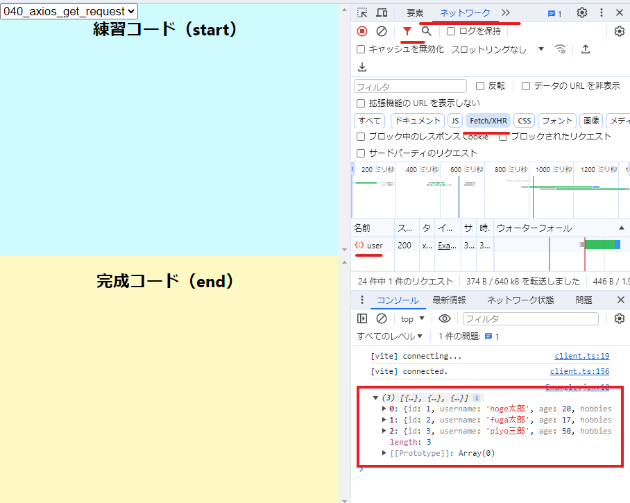
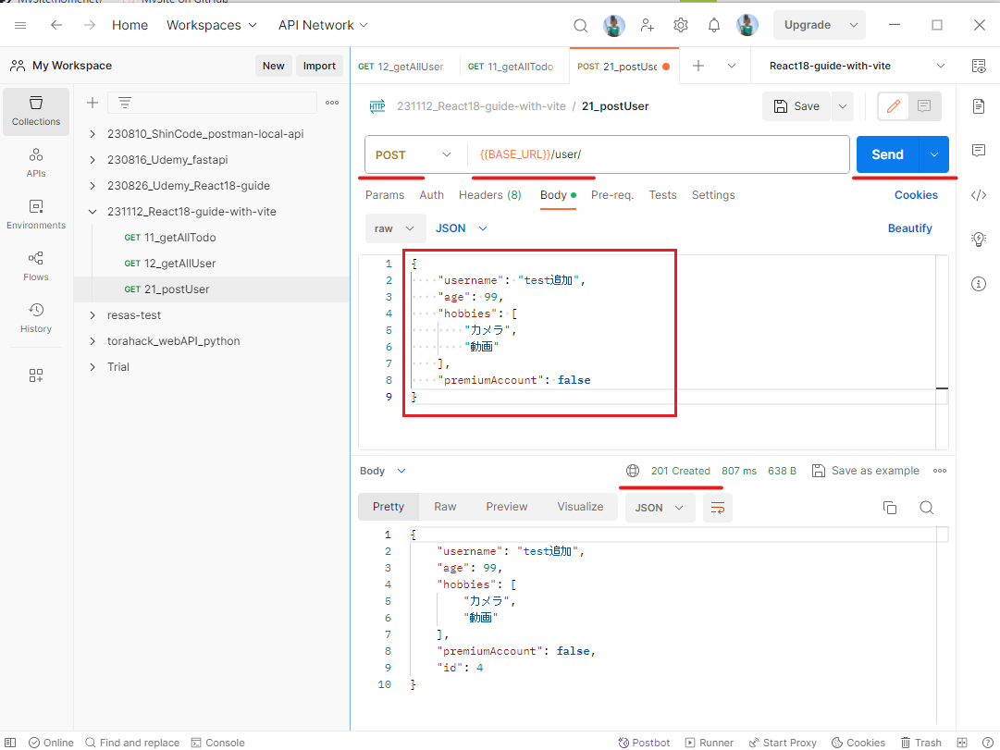
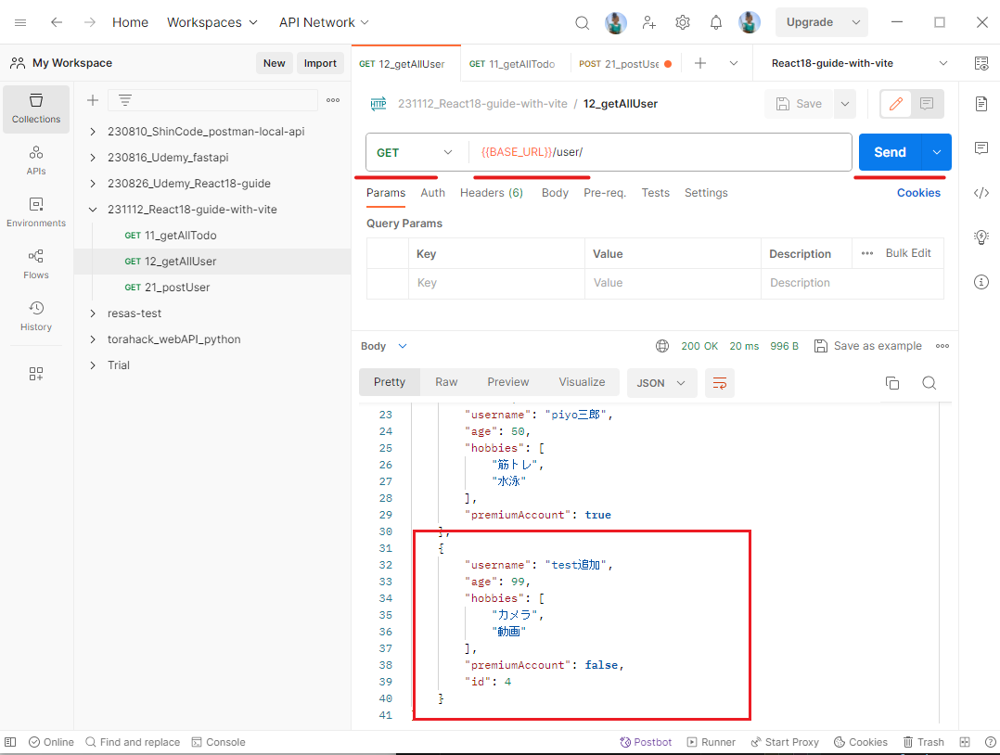

[to TopPage](../README.md)

# 16_RestAPIを使ったサーバーとの通信

## 講座一覧
- [169_セクション紹介](#169_セクション紹介)
- [170_REST−APIとは？](#170_rest−apiとは)
- [171_JSONとは？](#171_jsonとは)
- [172_JSON−ServerでモックアップAPIを作成](#172_json−serverでモックアップapiを作成)
- [173_Axiosを使ってサーバーからデータを取得しよう](#173_axiosを使ってサーバーからデータを取得しよう)
- [174_取得したデータを画面に反映してみよう](#174_取得したデータを画面に反映してみよう)
- [175_GUIでリクエストの状態を確認しよう](#175_guiでリクエストの状態を確認しよう)
- [176_更新リクエストをサーバーに送信してみよう](#176_更新リクエストをサーバーに送信してみよう)
- [177_リクエストと画面処理を統合しよう](#177_リクエストと画面処理を統合しよう)
- [178_【発展】ダイナミックインポートとは？](#178_発展ダイナミックインポートとは)
- [179_【発展】コンポーネントのダイナミックインポート](#179_発展コンポーネントのダイナミックインポート)


## 169_セクション紹介
[toTop](#)

- RESTful APIを使って、サーバとの通信をどのようにハンドリングをするかを紹介

## 170_REST−APIとは？
[toTop](#)

- REST（RESTful）-APIとは、サーバへのリクエスト方式の一つ
  * リソース毎にURI を定義
  * メソッドでリソースに対する処理を定義
    * POST、GET、PUT、DELETE など
  * JSON でやり取りする
- 基本的には、クライアント（PCのブラウザ）からサーバへのリクエスト方式

### RESTful-APIの利用する／しない場合の処理の変化
- REST-APIを使わない場合
  * データの取得・作成・更新毎にURL+クエリパラメータを作成する
  * やりたいことをURLかクエリパラメータに定義する
- REST-API を使う場合
  * やりたいことはメソッドで表現できる

## 171_JSONとは？
[toTop](#)

- JavaScript Object Notationの略語が、`JSON`
  * Notationとは『記法』のことだから、『JavaScript Objectのような記法』という意味
  * JavaScript のデータ定義文をベースとした、簡易的なデータ定義言語
    * 様々な言語間のデータ通信の際に用いられることが多い
    * 従来、XML が利用されてたが、冗長が少ないJSONの利用に移行してきてる
  * ファイルの拡張子は、`json`
    * JSONはコメントを許可しないが、拡張子が`jsonc`はコメントが記述できる
    * 配列・オブジェクトの記法ルールに似ている
      * オブジェクト（`Key-Value`）は、**Keyにも`"..."`で囲う必要がある**
      * JavaScriptと異なり、オブジェクトValue が文字列の時、ダブルクォーテーション（`"..."`）で囲む
      * JSONでは、オブジェクトや配列の末尾は`,`を付けない
  

### サンプルデータ
- データサンプル：[end sample](./src/020_what_is_json/end/sample.jsonc)
```jsonc
// POINT JSONとは
// JavaScript Object Notation の略称
// JavaScript のデータ定義文をベースとした、簡易的なデータ定義言語
// 様々な言語間のデータ通信の際に用いられることが多い
// これまでは XML が利用されてきましたが、現在では簡易的な JSON が利用されることが増えています
// JSON ファイルは拡張子 .json で記述する
// 通常の json ファイルの場合はコメントを書くことができないが、 .jsonc にするとコメントを書くことができる。
[
  // オブジェクトのkeyはダブルコーテーションを使用する
  {
    "id": 1,
    "username": "hoge太郎",
    "age": 20,
    "hobbies": [
      "soccer"
    ],
    "premiumAccount": true
  },
  {
    "id": 2,
    "username": "fuga太郎",
    "age": 17,
    "hobbies": [
      "カメラ"
    ],
    "premiumAccount": false
  },
  {
    "id": 3,
    "username": "piyo太郎",
    "age": 20,
    "hobbies": [
      "筋トレ"
    ],
    "premiumAccount": true
  }
]
```

### サーバへのJSONデータをやりとりするには
- JavaScriptの配列／オブジェクトをJSONデータ（の文字列）に変換して、やり取りする
- クライアント⇒サーバへ送る場合：`JSON.stringify()`メソッドで変換する
  - `JSON.stringify(配列／オブジェクト)`
  - 変換したデータは文字列である
```jsx
  const usersData = [
    {
      id: 1,
      username: "hoge太郎",
      age: 20,
      hobbies: ["soccer"],
      premiumAccount: true
    },
    ...
  ];
  // JSON.stringify = オブジェクトや配列をJSON形式の文字列に変換する
  const usersDataString = JSON.stringify(usersData);
  // JSON形式の文字列が出力される
  console.log(typeof usersDataString === 'string');
```

- サーバ⇒クライアントへ受け取る場合：`JSON.parse()`メソッドで変換する
  - `JSON.parse（JSON文字列）`
```jsx
  // JSON形式の文字列をJavaScriptが認識できる形に変換する
  console.log(JSON.parse(usersDataString));
  // [
  //   {
  //     id: 1,
  //     username: "hoge太郎",
  //     age: 20,
  //     hobbies: ["soccer"],
  //     premiumAccount: true
  //   },
  //   ...
  // ];
```

#### ソースコード：
- [end source](./src/020_what_is_json/end/Example.jsx)
- サンプルコード：
```jsx
const Example = () => {
  const usersData = [
    {
      id: 1,
      username: "hoge太郎",
      age: 20,
      hobbies: ["soccer"],
      premiumAccount: true
    },
    {
      id: 2,
      username: "fuga太郎",
      age: 17,
      hobbies: ["カメラ"],
      premiumAccount: false
    },
    {
      id: 3,
      username: "piyo太郎",
      age: 20,
      hobbies: ["筋トレ"],
      premiumAccount: true
    }
  ];

  // JSON.stringify = オブジェクトや配列をJSON形式の文字列に変換する
  const usersDataString = JSON.stringify(usersData);

  // JSON形式の文字列が出力される
  console.log(typeof usersDataString === 'string');

  // JSON形式の文字列をJavaScriptが認識できる形に変換する
  console.log(JSON.parse(usersDataString));

};

export default Example;
```

## 172_JSON−ServerでモックアップAPIを作成
[toTop](#)

### 単体での起動方法
```sh
# パッケージのインストール
pnpm i json-server@0.17.0 -D
# json-serverの実行（`npx`コマンド利用）
# ポート番号は、クライアント側が決め打ち（`:3003`）のため、指定する
npx json-server -w ./db/db.json -p 3003
# npx json-server -w ./**/db.json -p 3003 # 任意のファイルを指定したい場合、`**`利用
```

### APIサーバの準備はJSONファイルを準備する
- `json-server`でJSONファイルを読み込むと内容に応じたレスポンスを返す
- [sample data](./db/db.json)
- サンプルデータ：
```json
{
  "todo": [
    {
      "id": "c5868bfe-fa1d-4891-acd3-bc43959a9bb7",
      "content": "洗濯",
      "editing": false
    },
    {
      "id": "5d87d115-7ebb-4d17-adce-4ffe4b39f8c5",
      "content": "掃除",
      "editing": false
    },
    {
      "id": "f2c38014-e2df-40ae-ac93-36303b8771ce",
      "content": "買い物",
      "editing": false,
      "completed": false
    }
  ],
  "user": [
    {
      "id": 1,
      "username": "hoge太郎",
      "age": 20,
      "hobbies": ["サッカー", "野球"],
      "premiumAccount": true
    },
    {
      "id": 2,
      "username": "fuga太郎",
      "age": 17,
      "hobbies": ["カメラ"],
      "premiumAccount": false
    },
    {
      "id": 3,
      "username": "piyo三郎",
      "age": 50,
      "hobbies": ["筋トレ", "水泳"],
      "premiumAccount": true
    }
  ]
}
```

### JSONサーバ起動方法
- [package.json](./package.json)に指定済みのため、下のコマンドでもJSONサーバが起動される

```sh
npm run start:api
# npm run dev # クライアント同時の場合
```

#### `package.json`の指定
```jsx
  "scripts": {
    "dev": "npx concurrently \"pnpm run start:client\" \"pnpm run start:api\"",
    "start:api": "npx json-server -w ./db/db.json -p 3003",
    "start:client": "vite",
    ...
  },
```

## 173_Axiosを使ってサーバーからデータを取得しよう
[toTop](#)

### Axiosのインストール
- インストール済みですが、もし個別にインストールする場合は以下を実行する
```sh
pnpm i axios -S
```

### Aixosを使ったGETメソッド

- 実装ポイント
  * `import axios from "axios";`で読み込み
  * 非同期処理で、`axios.get()`メソッドを実行する
    * `Promise`で、thenでつなげる
    * `async`-`await`で同期化
  * 画面表示の時に、`axios.get()`で取得する場合、
    * `useEffect()`内で`axios.get(<URI>)`を利用
      * 非同期処理を`async`-`await`で同期化
      * ただし、`async`は`useEffect()`内にもう一つ関数を作って指定する必要がある
      + 理由：`useEffect(async() => {...})`と書くとエラーするため
```jsx
import { useEffect } from "react";
import axios from "axios";

// axiosでリクエストを送信
const Example = () => {
  useEffect(() => {
    const getUser = async () => {
      // res に応答データをセット
      const res = await axios.get('http://localhost:3003/user')
      console.log(res.data)
    }
    getUser();
  })
  ...
};
```

### ソースコード
- [end source](./src/040_axios_get_request/end/Example.jsx)
- エントリーコンポーネント：
```jsx
// POINT axiosでGetリクエスト
// https://axios-http.com/

import { useEffect } from "react";
import axios from "axios";

// axiosでリクエストを送信
const Example = () => {
  useEffect(() => {
    const getUser = async () => {
      const res = await axios.get('http://localhost:3003/user')
      console.log(res.data)
    }
    getUser();
  })
};

export default Example;
```

### 実行確認

- 実行は、ChromeDevToolsの**ネットワークタブ**で確認できる
  * フィルタ機能をオフ（`All`を指定）すると、全リクエストを確認できる
  * フィルタ機能で、`Fetch/XHR`のみにするとAPIリクエストがフィルタリングされて表示される




## 174_取得したデータを画面に反映してみよう
[toTop](#)

### ソースコード
- [end source](./src/050_axios_get_state/end/Example.jsx)
- エントリーコンポーネント：
```jsx
// POINT サーバーから取得したデータを画面表示
import { useEffect, useState } from "react";
import axios from "axios";

const Example = () => {

  const [ users, setUsers ] = useState()

  useEffect(() => {
    const getUser = async () => {
      const res = await axios.get('http://localhost:3003/user');
      // 取得後に画面更新するため、`setUsers()`で更新
      setUsers(res.data);
    }
    getUser();
  }, []); // `getUser()`は、初回レンダリングの時のみで実行する

  return (
    <div>
      {/*
      - オプショナルチェイン演算子（`users?`）で、データが無い場合のエラーを回避
      - 解説：`users`定義する際（`useState()`）、`undefined`になるので回避が必要
        - `users`とした時、`useState() ～ useEffect内`setUsers`の間でエラーになる
      */}
      {users?.map(user => {
        return (
          /* key属性は、レスポンスの`user.id`を利用 */
          <div key={user.id}>
            <h3>{user.username}</h3>
            <p>age: {user.age}</p>
            {/* `user.hobbies`は配列なので、表示の際に`,`で区切る */}
            <p>hobby: {user.hobbies.join(',')}</p>
          </div>
        )
      })}
    </div>
  )
};

export default Example;
```

## 175_GUIでリクエストの状態を確認しよう
[toTop](#)

- クライアントアプリ以外で、jsonサーバのデータを更新する方法を紹介：
  * Restful APIのクライアントツールを使ってPOSTメソッド、GETメソッドを投げてみる
  * 利用ツール：Postman
    * 参考サイト：『[Create and send API requests in Postman](https://learning.postman.com/docs/sending-requests/requests/)』
- 手順：Postmanの`Collections`は[JSONファイル](./assets/231112_React18-guide-with-vite.postman_collection.json)にエクスポート
  * `User`追加：Postmanで`POST`メソッドを選択し、Bodyをセットして、`Send`をクリック
  * `Users`確認：Postmanで`GET`メソッドを選択し、`Send`をクリック
  * `json-server`の反応を確認：`POST`メソッド・`GET`メソッドの受信を確認
```sh
[1]   \{^_^}/ hi!
[1]
[1]   Loading ./db/db.json
[1]   Done
[1]
[1]   Resources
[1]   http://localhost:3003/todo
[1]   http://localhost:3003/user
[1]
...
[1] POST /user/ 201 766.898 ms - 131
[1] GET /user/ 200 3.499 ms - 599
[1] GET /user 200 3.351 ms - 599
```

 １．`POST`で追加 | ２．`GET` で確認
 -- | --
  | 


## 176_更新リクエストをサーバーに送信してみよう
[toTop](#)

- 以前作成した『[ToDoアプリ](../06_control_and_form/README.md#071_todoアプリを作ってみよう)』をRESTful-APIで実弁してみる

#### ソースコード：
- [end source](./src/060_other_method/end/Example.jsx)
- エントリーコンポーネント：
```jsx
// POINT Rest APIをaxiosで実装してみよう
import Todo from "./components/Todo";

const Example = () => {
  return (
    <>
      <h2>Reminder</h2>
      <Todo />
    </>
  );
};

export default Example;
```

- `Todo`コンポーネント：
```jsx
import List from "./List"
import Form from "./Form"
import { TodoProvider } from "../context/TodoContext"

const Todo = () => {
  return (
    <TodoProvider>
      <List />
      <Form />
    </TodoProvider>
  )
};
export default Todo;
```

- `TodoProvider`モジュール：次セクションで解説
```jsx
import { createContext, useContext, useEffect, useReducer } from "react";
import todoApi from "../api/todo";

const TodoContext = createContext();
const TodoDispatchContext = createContext();

const todosList = [
  {
    id: 1,
    content: "店予約する",
    editing: false,
  },
  {
    id: 2,
    content: "卵買う",
    editing: false,
  },
  {
    id: 3,
    content: "郵便出す",
    editing: false,
  },
];

const todoReducer = (todos, action) => {
  switch (action.type) {
    // 追加アクション：
    // - 初回レンダリングで実行するアクション
    case "todo/init":
      return [...action.todos];

    case "todo/add":
      return [...todos, action.todo];

    case "todo/delete":
      return todos.filter((todo) => {
        return todo.id !== action.todo.id;
      });

    case "todo/update":
      return todos.map((_todo) => {
        return _todo.id === action.todo.id
          ? { ..._todo, ...action.todo }
          : { ..._todo };
      });

    default:
      return todos;
  }
};

const TodoProvider = ({ children }) => {
  const [todos, dispatch] = useReducer(todoReducer, []);

  // 改造（追加）部分：
  // - 初回レンダリングの時に、`todos`を更新する
  useEffect(() => {
    // `todos`の初期値は、前段に記載している内容：
    // const todosList = [
    // {
    //   id: 1,
    //   content: "店予約する",
    //   editing: false,
    // },
    // ....
    todoApi.getAll().then(todos => {
      dispatch({ type: 'todo/init', todos })
    })
  }, [])

  return (
    <TodoContext.Provider value={todos}>
      <TodoDispatchContext.Provider value={dispatch}>
        {children}
      </TodoDispatchContext.Provider>
    </TodoContext.Provider>
  );
};

const useTodos = () => useContext(TodoContext);
const useDispatchTodos = () => useContext(TodoDispatchContext);

export { useTodos, useDispatchTodos, TodoProvider };
```

- `todoApi`モジュール：
  - 改造の最初は、APIアクセス部分のみをJavaScriptで実装する
```jsx
// POINT axiosを用いたAPI
import axios from 'axios';

const ENDPOINT_URL = 'http://localhost:3003/todo'

const todoApi = {
    async getAll() {
        const result = await axios.get(ENDPOINT_URL);
        // console.log(result);
        return result.data;
    },
    async post(todo) {
        const result = await axios.post(ENDPOINT_URL, todo);
        return result.data;
    },
    async delete(todo) {
        const result = await axios.delete(ENDPOINT_URL + '/' + todo.id);
        return result.data;
    },
    async patch(todo) {
        const result = await axios.put(ENDPOINT_URL + '/' + todo.id, todo);
        return result.data;
    }
}

// APIアクセスの挙動を確認したい場合、関数を呼び出してみる
// todoApi.post({
//     id: 12345,
//     content: "test"
// });

export default todoApi;
```

- `Form`コンポーネント：次セクションで説明
```jsx
import { useState } from "react";
import { useDispatchTodos } from "../context/TodoContext";
import todoApi from "../api/todo";

const Form = () => {
  const [enteredTodo, setEnteredTodo] = useState("");
  const dispatch = useDispatchTodos();

  const addTodo = (e) => {
    e.preventDefault();

    const newTodo = {
      id: Math.floor(Math.random() * 1e5),
      content: enteredTodo,
      editing: false
    };

    todoApi.post(newTodo).then(newTodo => {
      dispatch({ type: 'todo/add', todo: newTodo});
      setEnteredTodo("");
    })

  };
  return (
    <div>
      <form onSubmit={addTodo}>
        <input
          type="text"
          value={enteredTodo}
          onChange={(e) => setEnteredTodo(e.target.value)}
        />
        <button>追加</button>
      </form>
    </div>
  );
};

export default Form;
```

- `List`コンポーネント：次セクションで説明
```jsx
import { useTodos } from "../context/TodoContext";
import Item from "./Item";

const List = () => {
  const todos = useTodos();
  return (
    <div>
      {todos.map((todo) => (
        <Item todo={todo} key={todo.id} />
      ))}
    </div>
  );
};

export default List;
```

- `Item`コンポーネント：次セクションで説明
```jsx
import { useState } from "react";
import { useDispatchTodos } from "../context/TodoContext";
import todoApi from "../api/todo";

const Item = ({ todo }) => {
  const [editingContent, setEditingContent] = useState(todo.content);
  const dispatch = useDispatchTodos();

  const changeContent = (e) => setEditingContent(e.target.value);

  const toggleEditMode = () => {
    const newTodo = { ...todo, editing: !todo.editing };
    todoApi.patch(newTodo).then((newTodo) => {
      dispatch({ type: "todo/update", todo: newTodo });
    });
  };

  const confirmContent = (e) => {
    e.preventDefault();
    const newTodo = {
      ...todo,
      editing: !todo.editing,
      content: editingContent,
    };
    todoApi.patch(newTodo).then((newTodo) => {
      dispatch({ type: "todo/update", todo: newTodo });
    });
  };

  const complete = (todo) => {
    todoApi.delete(todo).then(() => {
      dispatch({ type: "todo/delete", todo });
    });
  };

  return (
    <div key={todo.id}>
      <button onClick={() => complete(todo)}>完了</button>
      <form onSubmit={confirmContent} style={{ display: "inline" }}>
        {todo.editing ? (
          <input type="text" value={editingContent} onChange={changeContent} />
        ) : (
          <span onDoubleClick={toggleEditMode}>{todo.content}</span>
        )}
      </form>
    </div>
  );
};

export default Item;
```


## 177_リクエストと画面処理を統合しよう
[toTop](#)

### 練習問題：
- 『Todoアプリに`axios`のデータアクセスを加えよう』
- [start code](./src/060_other_method/start/Example.jsx)

### 変更内容
- `Reducer`のアクションの処理データを、`axios`を使って取得・発行する
  - `Reducer`のアクション定義は変更しない

#### Todo一覧取得
- `TodoProvider`モジュールで、初回レンダリング時に`todos`をGETメソッドで取得
```jsx
import { createContext, useContext, useEffect, useReducer } from "react";
import todoApi from "../api/todo";
...
const TodoProvider = ({ children }) => {
  const [todos, dispatch] = useReducer(todoReducer, []);

  // 改造（追加）部分：
  // - 初回レンダリングの時に、`todos`を更新する
  useEffect(() => {
    todoApi.getAll().then(todos => {
      dispatch({ type: 'todo/init', todos })
    })
  }, [])
```

#### Todo追加
- `Form`コンポーネントで、POSTメソッドを使用
```jsx
import { useDispatchTodos } from "../context/TodoContext";
import todoApi from "../api/todo";

const Form = () => {
  const [enteredTodo, setEnteredTodo] = useState("");
  const dispatch = useDispatchTodos();

  const addTodo = (e) => {
    e.preventDefault();

    const newTodo = {
      id: Math.floor(Math.random() * 1e5),
      content: enteredTodo,
      editing: false
    };

    // POSTメソッドが成功したのちに、Reducerのアクション（`dispatch()`メソッド）実行
    todoApi.post(newTodo).then(newTodo => {
      dispatch({ type: 'todo/add', todo: newTodo});
      setEnteredTodo("");
    })

```

#### Todo更新
- `Item`コンポーネントで、PATCHメソッドを使用
```jsx
import { useState } from "react";
import { useDispatchTodos } from "../context/TodoContext";
import todoApi from "../api/todo";

const Item = ({ todo }) => {
  const [editingContent, setEditingContent] = useState(todo.content);
  const dispatch = useDispatchTodos();

  const changeContent = (e) => setEditingContent(e.target.value);

  const toggleEditMode = () => {

// 編集の開始／終了時点で、patchメソッド実行して、アクション実行して画面更新
    const newTodo = { ...todo, editing: !todo.editing };
    todoApi.patch(newTodo).then((newTodo) => {
      dispatch({ type: "todo/update", todo: newTodo });
    });
  };

  const confirmContent = (e) => {
    e.preventDefault();
    const newTodo = {...};
    // patchメソッド実行して、アクション実行して画面更新
    todoApi.patch(newTodo).then((newTodo) => {
      dispatch({ type: "todo/update", todo: newTodo });
    });
  };
```

#### Todo追加
- `Item`コンポーネントで、DELETEメソッドを使用
```jsx
  const complete = (todo) => {
    todoApi.delete(todo).then(() => {
      dispatch({ type: "todo/delete", todo });
    });
  };
```


## 178_【発展】ダイナミックインポートとは？
[toTop](#)

- `import`文に相当する関数`import()`を利用してモジュールを詠み込む
  * `import()`の返り値はPromiseなので、非同期処理(`then`)でつないで動的に読み込める
  * その時々でモジュール読込み、モジュール切り替えができるようになる

### 通常のimport処理
- `import`文より、ソースをコンパイルするときに外部モジュールをインポートする
```jsx
import { add } from "./add";
const Example = () => {
    // 詠み込んだ関数を呼び出す
    console.log(add(1,2));
};
export default Example;
```

### ダイナミックインポートの処理
- 非同期処理で`import()`メソッドを実行して、外部モジュールをインポートする
  * この処理はReactでなくても実装できる
```jsx
// import { add } from "./add";
const Example = () => {
    const dynamicImport = async () => {
        const module = await import("./add");
    }
    dynamicImport(); // このタイミングでインポート（併せて、非同期で読み込む）
    // console.log(add(1,2))
};
```

#### ソースコード：
- [end source](./src/070_dynamic_import/end/Example.jsx)
- エントリーコンポーネント：
```jsx
// POINT ダイナミックインポートとは
const Example = () => {
    const dynamicImport = async () => {
        const module = await import("./add");
        // console.log(module);
    }
    dynamicImport();
    // console.log(add(1,2))
};

export default Example;
```

## 179_【発展】コンポーネントのダイナミックインポート
[toTop](#)

- Reactのコンポーネントをダイナミックインポートを拡張した`lazy`を紹介
  * Reactの`lazy`で、ダイナミックインポートが行える（動的にコンポーネントを詠み込める）
  ```jsx
  // lazy経由でimport関数を使う
  const LazyComponentA = lazy(() => import('./components/ComponentA'))
  ```
  * ネットワーク処理を疑似的に遅くしたい場合、ChromeDevToolsで変更できる
    * ネットワークのプリセット処理を『低速 3G』に変更する

### 初期状態
```jsx
// POINT コンポーネントをダイナミックインポート
import { useState } from "react";
import ComponentA from "./components/ComponentA";

const Example = () => {
  const [compA, setCompA] = useState(true);
  return (
    <>
      <button onClick={() => {
        setCompA((prev) => !prev)
      }}>ComponentA</button>
      {compA && <ComponentA />}
    </>
  );
};

export default Example;
```

### ダイナミックインポートを使った状態
```jsx
// POINT コンポーネントをダイナミックインポート
import { useState, lazy, Suspense, startTransition } from "react";
// import ComponentA from "./components/ComponentA";

// lazy経由でimport関数を使う
const LazyComponentA = lazy(() => import('./components/ComponentA'))
const LazyComponentB = lazy(() => import('./components/ComponentB'))

const Example = () => {
  // const [compA, setCompA] = useState(true);
  const [compA, setCompA] = useState(false);

  return (
    <>
      <button onClick={() => {
        startTransition(() => {
          setCompA((prev) => !prev)
        })
      }}>ComponentA</button>

      {/*
      * 読込みをしているのをユーザに認識できるように、Suspenseコンポーネントが用意
      * Suspenseコンポーネントで囲むとlazyの読出し中の表示を切り替えられる
      */}
      <Suspense fallback={<div>Loading!!!!!!!!</div>}>
        {compA ? <LazyComponentA /> : <LazyComponentB />}
      </Suspense>
    </>
  );
};

export default Example;
```

#### ソースコード：
- [end source](./src/080_react_lazy/end/Example.jsx)
- エントリーコンポーネント：
```jsx
// POINT コンポーネントをダイナミックインポート
import { useState, lazy, Suspense, startTransition } from "react";

const LazyComponentA = lazy(() => import('./components/ComponentA'))
const LazyComponentB = lazy(() => import('./components/ComponentB'))

const Example = () => {
  const [compA, setCompA] = useState(true);

  return (
    <>
      <button onClick={() => {
        startTransition(() => {
          setCompA((prev) => !prev)
        })
      }}>ComponentA</button>
      <Suspense fallback={<div>Loading!!!!!!!!</div>}>
        {compA ? <LazyComponentA /> : <LazyComponentB />}
      </Suspense>
    </>
  );
};

export default Example;
```

- `LazyComponentA`コンポーネント：
```jsx
const ComponentA = () => {
  return <h3>Loaded ComponentA!</h3>;
};

console.log('loaded componentA')

export default ComponentA;
```

- `LazyComponentB`コンポーネント：
```jsx
const ComponentB = () => {
  return <h3>Loaded ComponentB!</h3>;
};

export default ComponentB;
```
